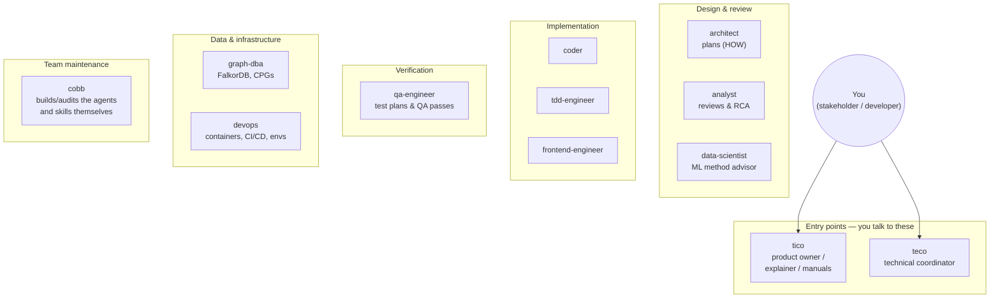
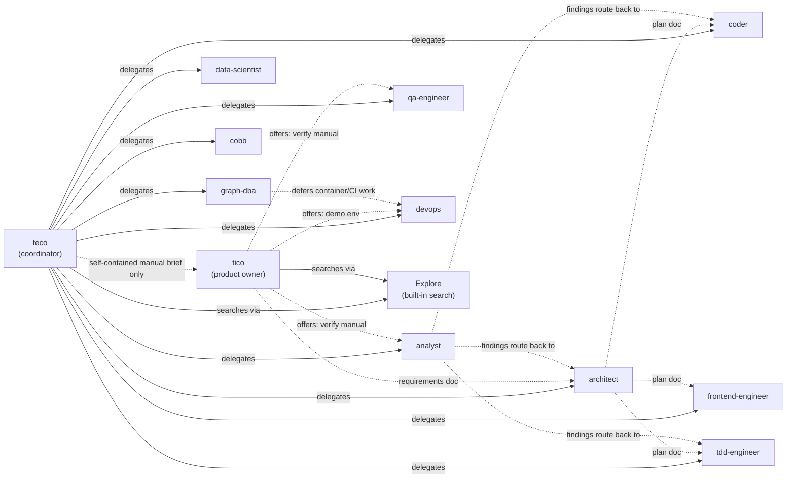
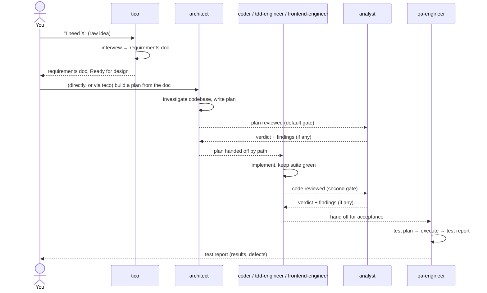

# The Claude Agent Team — User Manual

> **Status:** active · **Owner:** `tico` · **Tracks:** — (—)

## Who this is for

Anyone directing work in this repo through Claude Code — a stakeholder asking for a feature,
a developer who wants a plan reviewed, or someone just trying to figure out **which agent to
talk to** for a given job. You don't need to know how any agent is built to use this manual;
you just need to know who does what, and how work flows between them once it's in motion.

## Overview

This repo has a roster of specialist agents living in `claude/` (one folder per agent, symlinked
into Claude Code's config). Two of them are **entry points** — the ones you, the human, talk to
directly:

- **`tico`** — your product owner. Talk to `tico` when you have a raw idea, a complaint, or a
  question about how something works, or when you want end-user documentation written. Launch it
  as its own session: `claude --agent tico`.
- **`teco`** — your technical coordinator. Talk to `teco` (or let Claude Code auto-route to it)
  when the work spans multiple steps or specialties — a whole feature delivery, not a single
  question.

Everyone else on the roster is a **specialist**: an expert in one discipline (architecture,
implementation, testing, graph databases, DevOps, ML methodology, agent engineering itself) who
normally gets pulled in by `teco` — or, for a subset of jobs, by `tico` — rather than something
you address directly. You *can* address a specialist directly for a narrow, one-shot ask (e.g.
"architect, give me a plan for X"), but the moment a job has more than one moving part, routing it
through `teco` is what keeps the pieces from being dropped.

## Diagrams

### Team structure

*Reading it:* the top row is where you start. Everything below is a discipline the coordinator
(or, for a narrow slice, the product owner) reaches into. `cobb` is set apart because it doesn't
build features — it builds and audits the *other agents*.

### Who calls whom

*Reading it:* a **solid arrow** is a live delegation — one agent hands a self-contained brief to
another and gets a result back in the same run. A **dotted arrow** is a document or a routing
decision changing hands — usually by file path, and usually with a human (or `teco`) deciding
what happens next, not an automatic call. Nobody but `teco` (and, narrowly, `tico`) triggers a
live specialist run; every other line you see from a specialist is where its *output* is meant to
go, not a call it makes itself.

### A typical feature, start to finish

This is the shape most feature work takes, whether you run it yourself step by step or hand the
whole thing to `teco` to sequence for you. `teco`'s version of this same flow adds a coordination
ledger (a running log of who's doing what and where each deliverable landed) once a job has three
or more of these steps, or any step that needs a decision gate.

## Walkthroughs

### Starting from a raw idea

1. Launch `tico`: `claude --agent tico`.
2. Describe the idea in your own words — a complaint, a wish, a half-formed feature. `tico` will
   ask one question at a time, not a questionnaire, and will write your answers into a
   requirements document (`<component>/docs/requirements/<slug>.md`) as you go.
3. `tico` reads it back to you before calling it done. Once you confirm, its status flips to
   **Ready for design** — that's your (or `teco`'s) cue to hand the document's path to
   `architect` for the actual design.
4. `tico` will tell you the document's path and the natural next step — it never designs the
   solution itself.

### Getting something built end-to-end

1. Ask `teco` for the outcome you want, in plain terms — "ship feature X," not a pre-broken-down
   task list. `teco` runs in its own context and doesn't see your prior conversation with `tico`,
   so if requirements already exist, mention the document's path.
2. `teco` breaks the goal into ordered units, each with an owner (one of the specialists above),
   and a review gate. For three or more units, or anything with a decision gate, it keeps a
   coordination ledger (`<component>/docs/plans/<slug>-coordination.md`) so you can see progress
   without re-explaining anything.
3. `teco` pauses and asks you at genuine decision points — it does not guess when the requirements
   are unclear or a choice is really yours to make.
4. When it's done, `teco` reports what shipped, what got reviewed by whom, and where every
   deliverable landed (always by path, never a paraphrase).

### Asking "how does X work?" or "why was Y built that way?"

Just ask `tico` directly — no ceremony, no interview needed. It reads the real docs and code
before answering, translates into plain language, and will offer (never force) a live demo via
`devops` if actually seeing the thing beats more explanation.

### Getting a plan or a piece of code double-checked

`analyst` is the team's reviewer — it reads a plan or a diff and returns severity-ranked findings
plus a verdict (approve / approve with suggestions / needs changes), but it never changes the
artifact itself. If you're going through `teco`, this review is the default, not an opt-in step —
skipping it is treated as the exception, not the norm.

## FAQ / troubleshooting

**Can I just talk to a specialist (e.g. `architect`) directly, skipping `teco`?**
Yes, for a single, well-scoped ask. The moment the job has multiple steps or disciplines, route it
through `teco` instead — that's what keeps a dropped step or a skipped review gate from happening
silently.

**Why can't I delegate a requirements interview to `tico` through `teco`?**
Because an interview is a live conversation — it needs your answers turn by turn. `teco` will
tell you to run `tico` yourself (`claude --agent tico`) rather than fake the back-and-forth. The
one exception: a **manual update** where all the facts are already known (what shipped, where the
docs/code live) doesn't need a conversation, so `teco` *can* hand that specific job to `tico` as a
one-shot brief.

**Who reviews `tico`'s own user manuals?**
`tico` writes them, but doesn't self-certify a new or heavily-rewritten one — it offers you a
verification pass split by claim: `qa-engineer` walks the manual's steps against the running app
(does it actually work as described), `analyst` checks the architectural/factual claims. It's an
offer, not something forced on every small edit.

**What does `cobb` do, and when would I talk to it?**
`cobb` doesn't build product features — it builds and audits the agent team itself: writing new
agents, editing existing ones, and keeping the whole roster internally consistent (naming,
handoffs, hooks). If you want a *new team member* (not a new feature), that request still starts
as a `tico` requirements interview — `cobb` only designs the agent once that interview reaches
Ready for design.

**Does every specialist have the same authority to commit or write files?**
No. Only `tico` and `teco` can `git commit`, and only within their own lane (`tico`: the
requirements docs and manuals it authors; `teco`: a deliverable it has already verified, by
explicit path). Every other specialist's writes are scoped to its own kind of deliverable — a plan
document for `architect`, a review for `analyst`, and so on — enforced automatically, not just by
convention.
