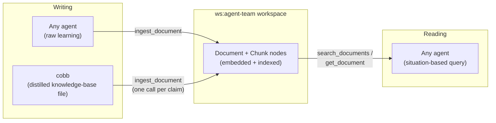
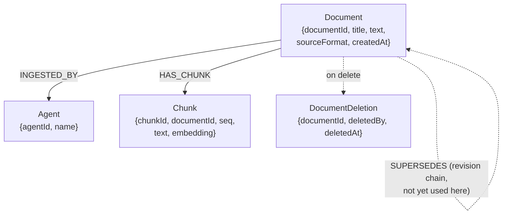

# Team Knowledge Base — User Manual

> **Status:** active · **Owner:** `tico` · **Tracks:** K-030 (M8)

## Who this is for

Anyone who writes into or reads from the Claude Code team's shared knowledge base — a Claude
Code agent looking up a distilled technique for its current situation, `cobb` curating and
publishing what the team has learned, or a human operator standing up or troubleshooting the
service that makes any of that possible. You don't need to know FalkorDB or Cypher to use this
system through its normal front door (the MCP tools below); you only need those details if
you're setting up the workspace itself or debugging something underneath it.

## Overview

The team keeps two kinds of knowledge in one place — a dedicated `falkor-chat` workspace called
**`ws:agent-team`**:

- **Raw kaizen capture** — every agent's day-to-day "here's something I learned" note, written
  the moment it's learned. This used to live only in a separate graph (`kaizen_team`); every
  agent's writes moved to `ws:agent-team` as of 2026-09-19, and `kaizen_team` itself was fully
  distilled and deleted on 2026-09-20 — it's no longer part of this system at all, live or
  historical (see the FAQ below if you're wondering what happened to what was in it).
- **Distilled knowledge** — the curated, "this is worth remembering" version `cobb` produces by
  reviewing raw capture over time. It still lives first as git-tracked Markdown files (each
  agent's own on-demand knowledge-base file); those files get *ingested* into `ws:agent-team` too,
  so their content becomes searchable the same way raw capture is.

Both kinds are stored the same way — as **documents** — and read back the same way — by
**searching**, not by opening a named file and reading it end to end. That's the actual point of
this system: a knowledge base file that just keeps growing eventually costs more to search by eye
than it saves; a graph-backed store lets an agent ask "what does the team already know about
*this specific situation*" and get back only the relevant piece.



## Walkthroughs

### 1. Writing a learning into the knowledge base (the API)

Every write goes through one MCP tool, `ingest_document`, served by a dedicated `falkor-chat`
process (see "Configuration & integration" below). There is no separate write tool for "raw"
vs. "distilled" content — the difference is only in *what* gets written and *who* writes it.

```
mcp__falkor-chat-agent-team__ingest_document(
    text: str,                      # required — the full content, verbatim
    title: str | None = None,       # a short label; shown in list_documents
    source_format: str = "text",
    source_label: str | None = None,
    produced_by: str | None = None, # the writing agent's own agentId
)
```

- **A raw-capture entry** (any agent, the moment it learns something worth keeping): `title` is
  the one-line fact; `text` is four labeled paragraphs — `Fact:` / `Evidence:` / `Context:` /
  `Suggested home:` — one per field, so a short entry stays one chunk and a longer one splits
  along field boundaries rather than mid-sentence.
- **A distilled-knowledge entry** (`cobb`, curating): one call per **claim**, not per file and
  not per heading — a heading that bundles several independently-attributed techniques becomes
  several calls, one per claim, each self-contained with its own example. `produced_by='cobb'`.

`produced_by` is optional but, when given, is checked against a real `Agent` node already
registered in the workspace — an unregistered name fails loudly (`AgentNotFoundError`) rather
than silently attributing to the wrong actor. Omit it and the write is attributed to whatever
actor the serving process is configured with (not per-caller) — fine for a one-off, not for
routine team-wide capture.

The call returns immediately with `{documentId, chunkCount, status: "processing"}` (the raw tool
response also carries two extra fields, `autoSuperseded`/`supersededDocumentId`, from an unrelated
document-update feature — safe to ignore for ordinary knowledge-base writes) — chunking happens
synchronously, but **embedding and indexing happen in the background**, right after the call
returns. The new document is readable via `get_document` immediately; it becomes
findable via `search_documents` only once that background embedding step lands (typically a
second or two) — the same "write now, searchable shortly after" pattern `falkor-chat` already
uses for chat messages.

There's also a bulk form, `ingest_documents(items: list[dict])`, for writing several documents in
one call (each item takes the same fields as above); a per-item failure (empty text, unknown
`produced_by`) doesn't abort the rest of the batch — that item's own result just comes back
`{"status": "error", ...}`.

### 2. Searching the knowledge base (the API, and the calling convention)

```
mcp__falkor-chat-agent-team__search_documents(query: str, limit: int = 20) -> list[dict]
mcp__falkor-chat-agent-team__get_document(document_id: str) -> dict | None
```

`search_documents` does **hybrid retrieval**: it runs both a semantic (vector-embedding)
similarity search and a lexical (full-text/keyword) search over stored chunks, then merges the
two rankings with Reciprocal Rank Fusion — so a query that shares an exact word or phrase with a
stored entry is found even when the embedding model's similarity score alone wouldn't have
surfaced it, and vice versa. Every returned row has already passed an admissibility check
server-side (a real semantic match, or a strong lexical match) — a caller does not need to apply
its own score threshold.

**There's a specific calling convention for this, and it matters:** the embedding model this lab
uses expects a fixed instruction prefix on the *query* side only (never on stored content). Before
calling `search_documents`, build:

```
f"Instruct: Given a coding agent's description of its current situation, retrieve the distilled technique or rule that applies to it.\nQuery: {situation}"
```

substituting your own one- or two-sentence situation description for `{situation}`, and call with
`limit=5` (the fixed, calibrated top-K for this workspace). The full convention — including the
"why," and a known residual quirk where a borderline-scoring result can read differently across
sessions — lives in `skills/agent-kb-retrieval/SKILL.md`; that file is the source of truth, this
manual just orients you to it.

A hit reports which `documentId` it came from, not necessarily the whole claim (a claim can
rarely straddle two chunks) — if you need the complete text, follow up with `get_document`.

### 3. Managing documents

```
mcp__falkor-chat-agent-team__list_documents(current_only: bool = True, limit: int = 50)
mcp__falkor-chat-agent-team__delete_document(document_id: str)
mcp__falkor-chat-agent-team__get_document_deletion(document_id: str)
mcp__falkor-chat-agent-team__get_document_history(document_id: str)
```

`list_documents` gives you a browsable index (oldest first) when you don't have a search query in
hand — e.g. `cobb` scanning for every entry sharing a family's title prefix (see the FAQ below).
`delete_document` is a real, explicit hard delete — its chunks disappear too — but the deletion
itself stays auditable via `get_document_deletion`. `get_document_history` walks a confirmed
revision chain when a document has been superseded by a newer version of itself (not yet
exercised routinely for this workspace's own content, but available).

### 4. Standing up or restarting the service (operator walkthrough)

This is the one-time or occasional operator task — most agents never need it.

```bash
cd falkor-chat
EMBEDDING_DIM=1024 ./scripts/bootstrap_schema.sh agent-team   # first time only: indexes/constraints, at the right vector dimension
./scripts/seed_agent_team.sh                                  # registers every claude/ agent as an Agent node
./scripts/start_agent_team.sh                                 # brings up the dedicated MCP-serving process
```

`EMBEDDING_DIM` matters on the **bootstrap** step specifically — that's what sizes the vector
index — not on `seed_agent_team.sh`, which never reads it.

`start_agent_team.sh` is a long-running process (like `start_server.sh`), not a one-shot script —
it's meant to stay up continuously so every agent's `.mcp.json` connection has somewhere to reach.
Restarting it does not lose data (everything lives in FalkorDB); it's only needed after a config
change or a crash.

## Graph data structures

`ws:agent-team` is an ordinary `falkor-chat` workspace graph — no new node or edge types were
invented for this feature. It reuses the same `Document`/`Chunk` shape `falkor-chat` already uses
for chat document ingestion generally:



- **`Document`** holds the whole ingested text verbatim, plus `title` (full-text-indexed, so
  `list_documents`/skimming works even without an embedding), `sourceFormat`, and `createdAt`.
  `source_label` (the `ingest_document` parameter) is **not** stored on the node — it's used only
  as a fallback for `title` when `title` is omitted, then discarded.
- **`Chunk`** is what actually gets searched: `falkor-chat`'s ingestion pipeline splits a
  document's `text` into paragraph/sentence-bounded pieces, each becoming one `Chunk` node
  carrying its own `embedding` (a vector, populated by a background embedding worker) and its
  `seq` (position within the document, for reassembly). Two indexes make this fast: a **vector
  index** on `Chunk.embedding` for semantic search, and a **full-text index** on `Chunk.text` for
  lexical search — `search_documents`'s hybrid fusion (above) queries both and merges the
  rankings.
- **`Agent`** nodes are what `produced_by` resolves against — one per `claude/` subagent
  (`teco`, `tico`, `architect`, …), seeded once by `seed_agent_team.sh` and re-run whenever the
  agent roster changes.
- **`DocumentDeletion`** is the audit trail left behind by `delete_document` — the document node
  itself is gone, but the fact that it existed and was deleted, by whom and when, is not.

There is one deliberate limitation worth knowing: a distilled claim that was split from a larger
heading during migration has no graph edge linking it back to its siblings — only a shared
title-prefix naming convention (`"<family-slug> — <claim-title>"`), recoverable by eye via
`list_documents`, not automatically by `search_documents`. This was a conscious trade-off (see
FAQ) rather than an oversight.

`falkor-chat`'s ingestion pipeline can also extract "entities" (named things mentioned in text)
into separate graph nodes in the background — that machinery exists in `falkor-chat` generally,
but `search_documents` for this workspace does not currently use it; retrieval here works purely
at the chunk level.

## Configuration & integration

**How an agent reaches this workspace at all:** the repo's `.mcp.json` names a dedicated MCP
server entry, `falkor-chat-agent-team`, pointed at `http://localhost:8200/mcp` — a distinct
`falkor-chat` server process from the one serving ordinary chat/demo/storefront traffic, on its
own port (`8200` by default), because a single `falkor-chat` process is pinned to one workspace
for its whole lifetime. Every `mcp__falkor-chat-agent-team__*` tool call in this manual is served
by that process specifically.

**Key environment variables** (all set by `start_agent_team.sh`, overridable):

| Variable | Default | Meaning |
|---|---|---|
| `FALKORCHAT_WS_ID` | `agent-team` | Which workspace this process serves — always pinned, never left to fall through to the generic default. |
| `AGENT_TEAM_PORT` | `8200` | This process's own port, separate from every other `falkor-chat` deployment's `8000`. |
| `EMBEDDING_DIM` | `1024` | Must match this lab's standing embedding model (Qwen3-Embedding); set at bootstrap time, before any data exists. |
| `FALKORCHAT_ENABLE_AGENT` | `1` | Required on — `search_documents` needs the embedding worker wired up; never set this to `0` for this process. |
| `FALKORCHAT_OPENCODE_CONFIG` | (resolved) | Provider config for the embedding model — this is an always-on process nobody may be watching when it cold-restarts, so it has an extra fallback tier beyond `start_server.sh`'s convention (see the script's own header comment). |
| `FALKORDB_HOST` / `FALKORDB_PORT` | `127.0.0.1` / `6379` | Where FalkorDB itself is reached. |

**A rule specific to this workspace:** nobody should add a `ws:agent-team`-specific override to
the shared model-config overlay (`FALKORCHAT_MODEL_CONFIG`). Leaving it unconfigured lets it fall
through correctly to the shared default model; adding an override here would silently change
which embedding model retrieval is calibrated against.

**For an agent that wants to write with attribution:** its `agentId` must already exist as an
`Agent` node in `ws:agent-team` before its first `produced_by`-carrying write — this is a one-time
team-roster seed (`seed_agent_team.sh`), not something each agent arranges for itself. If a new
agent is added to the team roster, that script needs a re-run, or that agent's writes will fail
loudly rather than silently misattribute.

**For an agent that wants to search knowledge relevant to its own prompt:** follow
`skills/agent-kb-retrieval/SKILL.md`'s exact calling convention (the query-instruction prefix,
`limit=5`) — an agent's own prompt should cite that skill by one line rather than restating or
reinventing the convention.

## FAQ / troubleshooting

**"I called `ingest_document` and immediately searched for it — nothing came back."** Expected —
embedding happens in the background right after the call returns, typically within a second or
two. `get_document` will show the content immediately; `search_documents` catches up shortly
after.

**"`ingest_document` failed, and the error message is just the bad id string I passed — it
doesn't say why."** That's the `AgentNotFoundError` case: the `produced_by` value you passed has
no matching `Agent` node in `ws:agent-team` yet. The error surfaced through MCP is terse (just the
unresolved id, not the exception name or an explanation) — if you see a failure shaped like this,
check that `produced_by` is spelled correctly and that the team roster has been re-seeded since
this agent was added (`seed_agent_team.sh`) before assuming something else is wrong.

**"What happened to `kaizen_team` (the old graph)? Is my old data lost?"** `kaizen_team` was the
system's original home for raw kaizen capture, before every agent's writes moved to
`ws:agent-team` on 2026-09-19. It was retired at that point but deliberately left running
unchanged rather than migrated — nothing in it needed to move, because `cobb`'s ordinary
distillation duty (see "Distilled knowledge," above) had already been working through it in
place, same as it does for `ws:agent-team` today: reviewing each raw entry, routing anything
worth keeping into an agent prompt, an on-demand knowledge base, or project docs, and only then
clearing the entry. By 2026-09-20 that process had fully drained it — every entry it ever held had
already been reviewed and either promoted or discarded, across three distillation passes — so the
graph itself was deleted as a pure infrastructure cleanup. Nothing was lost in that deletion: any
raw entry actually worth keeping is already git-committed wherever `cobb` routed it, not sitting
only in a graph. `kaizen_team` no longer exists in any form, live or dormant.

**"I just wrote a document, and `list_documents` doesn't show it."** `list_documents` is genuinely
oldest-first, with a default `limit=50` — on a workspace whose corpus has grown into the hundreds
of documents, a just-written entry is last in line and falls outside that default window. Pass a
larger `limit` (sized to the corpus, not just "a bit more") if you're checking for something
recent, or use `search_documents` instead once it's had a moment to embed.

**"`delete_document`'s audit record shows the wrong `deletedBy`."** `get_document_deletion`'s
`deletedBy` attributes to whichever actor the serving process is configured with, not to the
specific caller who invoked the deletion — the same non-per-caller pattern documented above for
an omitted `produced_by` on `ingest_document`. Not a bug; there's currently no per-caller identity
on the delete path either.

**"A search result looks like it's missing the rest of the claim."** A claim can occasionally
straddle two chunks of the same document — follow up with `get_document` using the hit's
`documentId` to read the whole thing. If you suspect it was split from a larger family of related
claims during migration, a manual `list_documents` scan for the same title prefix is the only way
to find the siblings today — there's no automatic "pull related claims" step.

**"Two searches for the same thing gave me slightly different-looking rankings near the bottom of
the results."** A known, narrow residual: when several results' scores sit very close together
near the admissibility floor, which one edges out the other can vary slightly between sessions.
It doesn't affect a clearly-relevant top result — see `skills/agent-kb-retrieval/SKILL.md` for the
full detail if it matters for your specific case.
