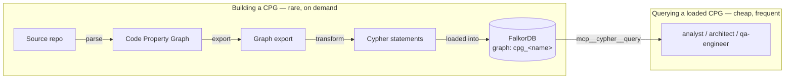
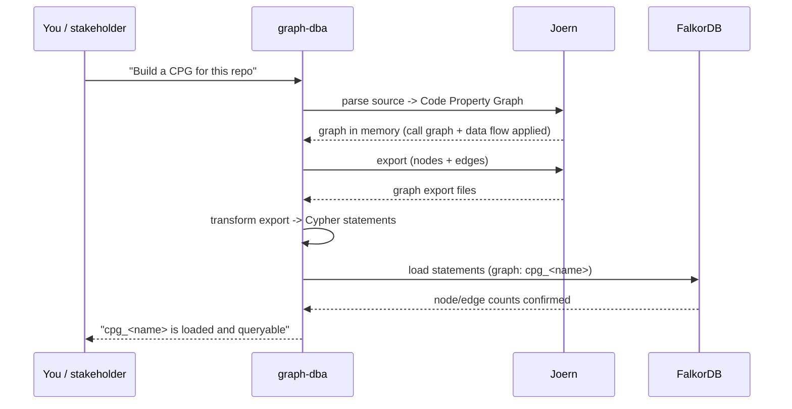
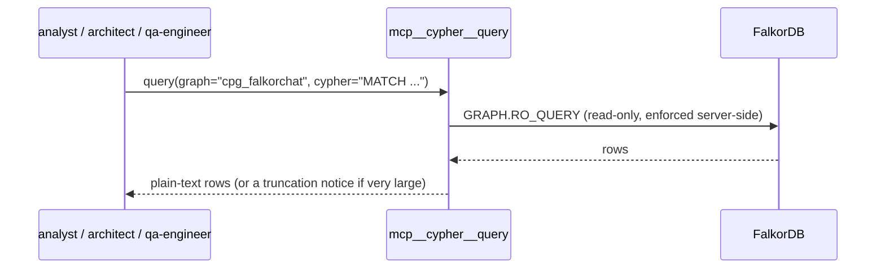

# Code Property Graph (Joern + FalkorDB) — Getting Started

> **Status:** active · **Owner:** `tico` · **Tracks:** C-201…C-208, C-301…C-307 (M1–M3) ·
> **Reviews:** [`docs/reviews/cpg-getting-started.md`](../reviews/cpg-getting-started.md) (analyst, approve with suggestions) ·
> [`docs/test-reports/cpg-getting-started-report.md`](../test-reports/cpg-getting-started-report.md) (qa-engineer, 1 defect fixed 2026-07-30)

## Who this is for

Anyone who wants to ask **structural questions about a codebase** — "who calls this
function?", "what would break if I change this?", "where does this value come from?",
"what code has no test reaching it?" — without hand-reading or grepping every file. In
practice that's mostly the Claude Code agents (`analyst`, `architect`, `qa-engineer`,
and `graph-dba` who builds the graph), but this manual is written so a human stakeholder
can also follow along, ask an agent to do it, or run the pieces by hand.

## Overview

Two things had to exist before any of this was useful, and they were built in that order:

1. **A graph of the code.** [Joern](https://docs.joern.io) reads source code and builds
   a **Code Property Graph (CPG)**: a graph where nodes are things like methods, call
   sites, parameters and literals, and edges capture relationships like "calls",
   "contains", and "this value flows into that one". That graph is exported and loaded
   into **FalkorDB** — the same graph database `falkor-chat` and `salesperson` already
   use — so it becomes a plain, queryable Cypher graph instead of a proprietary binary
   only Joern itself can read.
2. **A way to ask it questions without knowing its internals.** Once a CPG is sitting in
   FalkorDB, someone still has to know its schema (property names, edge types, the
   gotchas) to query it usefully. The `cpg-analysis` skill packages that knowledge as
   ready-to-adapt recipes, and the questions themselves travel through a small, dedicated
   MCP tool (`mcp__cypher__query`) instead of a hand-typed `redis-cli` command line.

**Two agents, two very different rhythms.** Building a CPG is **rare and deliberate** —
you ask for it when you need one, it can take minutes for a real repo, and reloading is
destructive (wipes what's there first). Querying an already-loaded CPG is **cheap and
frequent** — it's meant to be reached for the way you'd reach for `grep`, any time an
agent needs a structural answer.

**What this is not:** a code-search / RAG index (explicitly out of scope for now), a
continuously-synced mirror of the repo (each CPG is a snapshot from one point in time),
or a coverage tool (the "test gap" analysis below means *structural reachability*, not
executed lines).

## Walkthrough — checking you're ready

Nothing here needs setup from a stakeholder's side — the agents check their own
prerequisites — but it helps to know what "ready" looks like:

- **FalkorDB is running.** Everything downstream needs it reachable at `localhost:6379`.
  Start it with `./falkor-chat/scripts/start_falkordb.sh -d` if it's ever down — it's the
  same shared container `falkor-chat` and `salesperson` use, so it's usually already up.
- **The `cypher` MCP tool is connected**, if you're working inside Claude Code. Run
  `/mcp` in a session, or `claude mcp list` from a shell, and look for `cypher` — `✔
  Connected`. First run in a fresh clone may need `cypher-mcp/build.sh` once (it builds a
  small container); the tool self-heals on a miss, so this is a safety net, not a
  strict requirement.
- **A CPG actually exists for the repo you care about.** Nothing here works on thin
  air — see the next section.

If any of this is missing, the agents report it in plain language rather than silently
guessing — e.g. "no CPG loaded for that name" lists what *is* loaded.

## Walkthrough — building a CPG for a repo

This is **`graph-dba`'s job**, done **on demand** — it's not something that happens
automatically or continuously. Ask for it (in Claude Code: `@graph-dba build a CPG for
<repo/path>`), and expect it to take real time: JVM startup alone is 30–60 seconds per
step, and a full parse+export of a real repo is minutes, not seconds.

A few things worth knowing as the person asking for this, not doing it yourself:

- **A CPG is a snapshot.** It reflects the repo at the moment it was built — nobody
  auto-refreshes it as the code changes. If you've made changes since the last build and
  the answer matters, ask for a rebuild.
- **Rebuilding is destructive by design.** Loading into a graph that already has data
  refuses to run; a clean rebuild deletes the old graph first. That delete is guarded —
  `graph-dba` won't do it silently, it's an explicit, visible step (and destructive
  FalkorDB operations are hard-gated to require human approval in this project).
- **Scale is a real conversation to have.** A moderate Python file produces roughly
  2,700 nodes and 18,000 edges with the default level of detail; a large repo can reach
  multi-million-edge territory. If you're pointing this at something big, `graph-dba` may
  ask whether you need every relationship type or a narrower slice.
- **One CPG per named graph.** Graphs are conventionally named `cpg_<component>` (e.g.
  `cpg_falkorchat`) so several can coexist in the same FalkorDB instance without
  colliding.

## Walkthrough — asking the CPG a question

This is the frequent path, and it's designed to need no ceremony. Any of `analyst`,
`architect`, or `qa-engineer` can do this as a normal part of their work — you don't
have to ask for it explicitly, though you can ("use the CPG to find callers of
`post_message`").

What each agent uses it for, in plain terms:

| Agent | What it asks | In everyday terms |
|---|---|---|
| `analyst` / `architect` | **Impact analysis** | "What calls this? What would break if I change it?" |
| `analyst` | **Root-cause analysis** | "Where did this bad value come from? Where else is this symbol used?" |
| `analyst` | **Code review (taint)** | "Can something from outside reach a dangerous operation without being checked?" |
| `qa-engineer` | **Test-gap analysis** | "What production code has no test that structurally reaches it?" (this is about code *structure*, not about which lines actually ran) |

A couple of guarantees worth knowing about, because they shape what you can trust in an
answer:

- **It's read-only, enforced by the database itself** — not just by convention. A typo'd
  graph name can't accidentally create an empty graph, and a query can't accidentally
  write or delete anything, even by mistake.
- **Long answers are only *shown* trimmed, and the reported total is trustworthy for
  ordinary questions.** If a question matches a few thousand rows, the tool caps how
  much text comes back and says so explicitly (which cap, how many of how many) — the
  reported count is the true one. **For a very large, unfiltered question (tens of
  thousands of rows or more — e.g. "return every node in the graph")**, the reported
  count can itself be capped by FalkorDB's own internal limit and read lower than
  reality; if the true size of something matters, ask for a count/aggregate
  (`RETURN count(...)`) rather than trusting the row figure on an unfiltered dump. If a
  result looks arbitrarily cut, that's a cue to narrow the question (add an order,
  filter, or count), not to trust the first few rows as "the" answer.
- **A CPG only reflects the snapshot it was built from.** If an answer seems to describe
  code that no longer looks right, the likely explanation is that the CPG is stale — ask
  for a rebuild (see above), not "the tool is broken."
- **Outside Claude Code, the same graph is still reachable.** The MCP tool is
  Claude-Code-specific; querying directly with `redis-cli GRAPH.QUERY`/`GRAPH.RO_QUERY`
  is the documented fallback (and the only path in other tools today) — ask an agent, or
  see `cypher-mcp/README.md` for the exact command.

## FAQ / troubleshooting

**"No CPG loaded" / the graph name isn't found.**
Nobody has built one yet for that repo, or the name doesn't match what was used at load
time. Ask `graph-dba` to build one, or to confirm the exact graph name currently loaded.

**Can I just ask any question, in plain English?**
You ask the *agent* in plain English ("what calls `post_message`?"); the agent is the one
translating that into the actual graph query. You never need to know Cypher yourself.

**Is this kept in sync with the code automatically?**
No — a CPG is a snapshot, built on demand. If the code has moved since the last build and
that matters for your question, ask for a fresh one.

**Does "no test reaches this code" mean the tests actually don't execute it?**
Not quite — it means no test *entrypoint* structurally reaches it in the call graph.
That's a good proxy for "under-tested," but it's not the same as measured runtime
coverage (a different kind of tool answers that question).

**Why can several different CPGs exist at once?**
Each named graph (`cpg_<component>`) is independent, so a CPG for one part of the repo
doesn't interfere with, or get confused with, one for another part.

**What if FalkorDB itself is down?**
Nothing above works without it. `./falkor-chat/scripts/start_falkordb.sh -d` brings up
the shared container; it's shared with `falkor-chat` and `salesperson`, so it's rarely a
CPG-specific problem.

**I asked for "everything" and the row count looks too low for a graph this size — is that a bug?**
Not a bug, but a real limit to know about: for a very large, unfiltered question (tens
of thousands of rows or more), the reported total can itself be capped rather than
exact — see the caveat above. Add a filter, or ask for a `count(...)` directly, to get a
number you can rely on.
