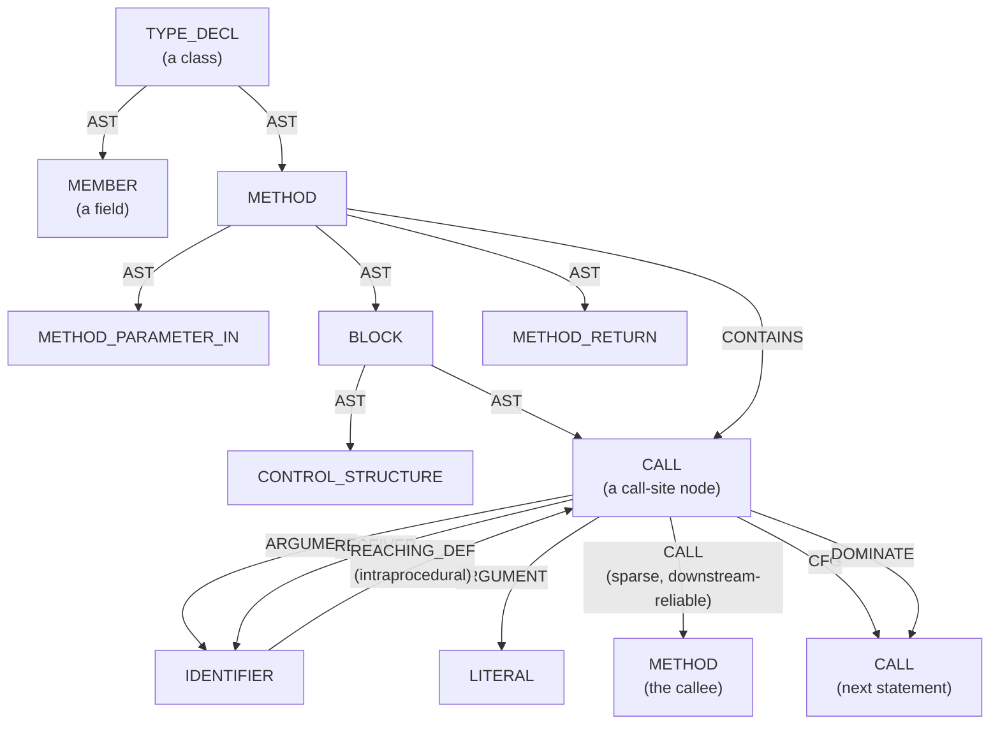
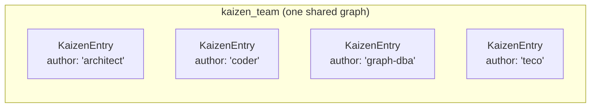
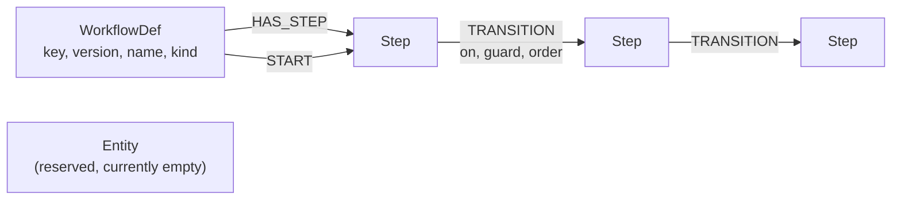
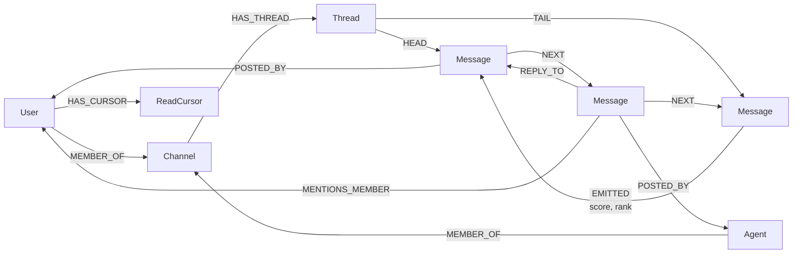
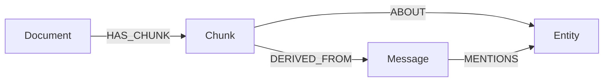
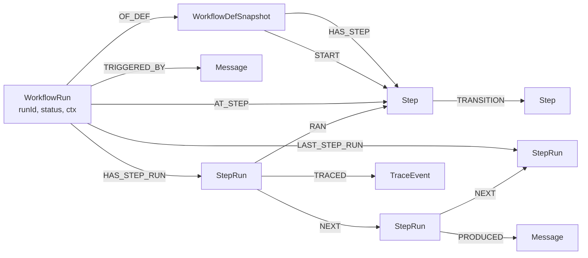

# Graph Ontology Reference — cpg, kaizen_team, reference & ws:* graphs
> **Status:** active · **Owner:** `tico` · **Tracks:** — (—)

## Who this is for

Anyone — human or agent — who is about to point a Cypher query at one of this repo's
FalkorDB graphs and wants to know **what they'll find before they go digging**: what
node types exist, what connects to what, what each property means, and which naming
convention applies. In practice that's mostly Claude Code agents using the `cypher` MCP
tool (`mcp__cypher__query(graph, cypher)`), but the same facts apply to a human running
`redis-cli GRAPH.QUERY` or `falkordb-py` by hand.

This is a **schema/ontology reference**, not a "how do I use the product" walkthrough —
if you want the process story of building and querying a Code Property Graph (who does
it, when, what guarantees you get), start with
[`docs/manuals/cpg-getting-started.md`](cpg-getting-started.md) instead; this document
picks up where that one stops describing internals, and does the same job for the other
three graph families this repo runs.

## Overview

FalkorDB holds many **independent named graphs** in one Redis instance — think of each
name as its own database. Two facts shape everything below:

- **A graph's schema lives entirely inside it.** `CALL db.labels()` and
  `CALL db.relationshipTypes()` against a graph name tell you what's actually in *that*
  graph, right now — nothing is shared or inherited from another graph.
- **Edges can never cross graphs.** A node in `ws:acme` cannot have a real relationship
  to a node in `reference` — only to another node in `ws:acme`. Where two graphs need to
  refer to each other, they do it with a plain property (a key the reader resolves with
  a second query) or by copying ("materializing") a small subgraph from one into the
  other. Keep this in mind whenever a diagram below shows two boxes that *look* like
  they could share an edge but don't.

**The four families this manual covers**, and what's actually loaded on this instance
today:

| Family | Graph key pattern | Loaded right now | Who writes it | Who reads it |
|---|---|---|---|---|
| Code Property Graph | `cpg_<component>` | `cpg_falkorchat`, `cpg_salesperson` | `graph-dba`, on demand (Joern build) | `analyst`, `architect`, `qa-engineer`, `coder` via the `cpg-analysis` skill |
| Kaizen working memory | `kaizen_team` | `kaizen_team` (single shared graph) | every Claude Code agent, appending its own notes | `cobb`, distilling |
| Reference catalog | `reference` | `reference` (one, global) | `falkor-chat`'s server, on workflow-def publish | `falkor-chat`'s server, materializing into workspaces |
| Workspace | `ws:<workspaceId>` | `ws:acme`, `ws:eval`, `ws:qa028`, `ws:test`, `ws:qa-tico-workflows-manual` | `falkor-chat`'s server, per workspace | `falkor-chat`'s server + its AI participant |

> You may also see a graph key called **`identity`** mentioned in `falkor-chat`'s design
> docs (global user identity/auth) — it is **designed but not built**; nothing is
> currently loaded under that name, and it's out of scope here. You may also see a stray
> **`kaizen_analyst`** key — see the FAQ below; it's an empty leftover, not a live graph.

**Two very different naming conventions.** This is the single most common mistake when
switching between families:

| | `cpg_*` (Joern) | `kaizen_team` / `reference` / `ws:*` (`falkor-chat`) |
|---|---|---|
| Node labels | `SCREAMING_SNAKE` (`METHOD`, `CALL`) | `PascalCase` (`Message`, `WorkflowRun`) |
| Relationship types | `SCREAMING_SNAKE` (`AST`, `REACHING_DEF`) | `UPPER_SNAKE` (`POSTED_BY`, `HAS_STEP`) — same convention, no divergence here |
| **Property keys** | **`UPPER_CASE`** (`m.NAME`, `m.CODE`, `m.FULL_NAME`) | **`camelCase`** (`m.msgId`, `m.createdAt`) |

A lowercase property lookup on a `cpg_*` graph (`m.name`) silently returns `null` — no
error, just an empty-looking answer. This bites everyone at least once.

**Looking inside any graph yourself, in three queries:**

```cypher
CALL db.labels() YIELD label RETURN label
CALL db.relationshipTypes() YIELD relationshipType RETURN relationshipType
MATCH (n:SomeLabel) RETURN properties(n) LIMIT 1
```

A query against a graph name that doesn't exist answers with the list of every graph
that *is* currently loaded — a quick way to check you have the right key.

## Walkthroughs

### 1. Code Property Graphs — `cpg_<component>`

**What it's for.** A structural map of one component's source code, built by
[Joern](https://docs.joern.io) and loaded into FalkorDB so it's a plain Cypher graph.
Nodes are things like methods, call sites, parameters and literals; edges capture
"calls," "contains," "this value flows into that one." See
[`cpg-getting-started.md`](cpg-getting-started.md) for the build/query *process*; this
section is the schema you'll actually query against.

**Node labels** (verified live on `cpg_falkorchat`; `cpg_salesperson` matches, minus
`CpgBuildInfo`, both built by the same `pysrc2cpg` frontend):

| Label | What it represents | Notable properties |
|---|---|---|
| `METHOD` | A function/method definition | `NAME`, `FULL_NAME`, `FILENAME`, `LINE_NUMBER`, `SIGNATURE`, `IS_EXTERNAL` (real boolean — `false` = first-party code) |
| `CALL` | **A call *site*** — one per call expression (not a method-to-method edge — see Gotchas) | `NAME`, `CODE`, `METHOD_FULL_NAME` (unreliable — see Gotchas), `LINE_NUMBER`, `ARGUMENT_INDEX` |
| `METHOD_PARAMETER_IN` / `METHOD_PARAMETER_OUT` | A formal parameter (in/out) | `NAME`, `INDEX`, `TYPE_FULL_NAME` |
| `METHOD_RETURN` | A method's return slot | `TYPE_FULL_NAME` |
| `IDENTIFIER` | A variable reference (a use) | `NAME`, `CODE` |
| `LOCAL` | A local variable declaration | `NAME`, `TYPE_FULL_NAME` |
| `LITERAL` | A literal value in source | `CODE` |
| `MEMBER` | A class field | `NAME`, `TYPE_FULL_NAME` |
| `FIELD_IDENTIFIER` | A `.field` access | `CODE` |
| `BLOCK` | A `{ }` statement block | `CODE` |
| `CONTROL_STRUCTURE` | `if`/`for`/`while`/etc. | `CODE`, `CONTROL_STRUCTURE_TYPE` |
| `RETURN` | A `return` statement | `CODE` |
| `TYPE_DECL` | A class/type declaration | `NAME`, `FULL_NAME`, `FILENAME` |
| `MODIFIER` | `static`/`public`/etc. tag | `MODIFIER_TYPE` |
| `METHOD_REF` | A reference to a method as a value | `METHOD_FULL_NAME` |
| `TYPE_REF` | A reference to a type as a value | `TYPE_FULL_NAME` |
| `IMPORT` | An import statement | `CODE` |
| `UNKNOWN` | A construct the frontend couldn't classify precisely | `CODE` |
| `CpgNode` | A **second label every node also carries** — not a real category, just a shared index anchor so an edge can look up any node by `id` without knowing its real label | `id` |
| `CpgBuildInfo` | One node per load, build provenance (`cpg_falkorchat` only — a newer transformer stamp) | `BUILT_AT`, `SOURCE_PATH` |

> Joern's generic vocabulary also documents `FILE`, `TYPE`, `NAMESPACE`,
> `NAMESPACE_BLOCK`, `META_DATA` — **confirmed absent** on both CPGs actually loaded
> here (frontend/export-configuration-dependent). Don't build a query that assumes
> they're there.

**Relationship types** (verified live on `cpg_falkorchat`):

| Type | Direction | Meaning |
|---|---|---|
| `AST` | parent → child | Syntax-tree structure — "what contains what" at the source level |
| `CONTAINS` | `METHOD` → `CALL` | Reach a method's nested call sites (the call-graph anchor — see Gotchas) |
| `CALL` | `CALL` (site) → `METHOD` (callee) | Resolved callee of a call site — **sparse**, see Gotchas |
| `ARGUMENT` | `CALL` → argument node | An argument passed at a call site |
| `RECEIVER` | `CALL` → node | The object a method is called on |
| `PARAMETER_LINK` | parameter ↔ parameter | Links an in/out parameter pair |
| `CFG` | statement → next statement | Control-flow (execution order) |
| `CDG` | predicate → statement | Control dependence ("which `if` guards this") |
| `REACHING_DEF` | def → use | Data flow — **intraprocedural only**, stops at call-site arguments |
| `DOMINATE` / `POST_DOMINATE` | node → node | Dominance relationships (compiler-analysis primitive) |
| `TRUE_BODY` / `FALSE_BODY` / `TRY_BODY` / `CATCH_BODY` / `FINALLY_BODY` | control structure → block | Which block is which branch of an `if`/`try` |
| `CONDITION` | control structure → expression | The guarding expression of an `if`/`while` |
| `REF` | identifier → declaration | Which declaration a variable reference resolves to |
| `IS_CALL_FOR_IMPORT` | `CALL` → `IMPORT` | Links a call site to the import it depends on |



**Try it:**

```cypher
// Find a method by name
MATCH (m:METHOD {NAME: 'post_message'})
RETURN m.FULL_NAME, m.FILENAME, m.LINE_NUMBER

// Its callees (downstream — reliable)
MATCH (m:METHOD {NAME: 'post_message'})-[:CONTAINS]->(c:CALL)-[:CALL]->(callee:METHOD)
RETURN DISTINCT callee.NAME, callee.FULL_NAME

// Its callers (upstream — match by name, the CALL edge is too sparse to rely on)
MATCH (caller:METHOD)-[:CONTAINS]->(:CALL {NAME: 'post_message'})
RETURN DISTINCT caller.NAME, caller.FILENAME
```

**Gotchas specific to this family:**

- **`CALL` the node and `CALL` the edge are two different things with the same name.**
  The node is one per call *expression* in the source; the edge points from that node to
  the resolved callee `METHOD`. There is no direct `(:METHOD)-[:CALL]->(:METHOD)` edge.
- **Caller resolution is sparse.** Only a minority of call sites resolve an outbound
  `CALL` edge (mostly same-object/same-file dispatch) — cross-object dispatch isn't
  resolved by this frontend. Downstream (callee) traversal is trustworthy; upstream
  (caller) traversal isn't — match on `CALL.NAME` instead, as above.
- **`METHOD_FULL_NAME` on a `CALL` node is inconsistent** — you may see a short form, a
  full path, a phantom `<returnValue>.method`, or `<unknownFullName>`. Don't join on it;
  match by `CALL.NAME` and disambiguate by the callee `METHOD`'s `FILENAME`.
- **`FILENAME` is only reliable on `METHOD` and `TYPE_DECL`.** For any other node, hop to
  its enclosing method (`(owner:METHOD)-[:CONTAINS]->(n)`) and read `owner.FILENAME` —
  it's relative to wherever the CPG was built from, not the repo root.
- Every node also carries a second label, `:CpgNode`, purely so edges can be resolved by
  `id` without knowing the target's real label — you'll rarely query it directly.

### 2. `kaizen_team` — the team's shared working memory

**What it's for.** A raw-capture scratchpad: every Claude Code agent writes short,
dated learning notes into it as it works, attributed to itself; `cobb` periodically
reads the graph, distills it into each agent's own `kaizen/history.md`, and clears
what's been distilled. It is deliberately **flat today** — one node type, no edges.

**Node label:**

| Label | What it represents | Properties |
|---|---|---|
| `KaizenEntry` | One raw learning note | `entryId` (uuid), `date`, `fact` (one line), `evidence` (what was run/read/observed), `context` (the task it surfaced in), `suggestedHome` (`prompt`\|`knowledge base`\|`project docs`\|`unsure`), `author` (the writing agent's slug — the *only* attribution mechanism today), `createdAt` (ISO-8601), optionally `sessionId` |

**Relationships:** none — attribution is a plain string property (`author`), not a
graph edge, and there is nothing else to connect to yet.



**Try it:**

```cypher
// Every note a given agent has produced, oldest first
MATCH (n:KaizenEntry {author: 'graph-dba'})
RETURN n.date, n.fact ORDER BY n.date

// How many un-distilled notes are waiting, per agent
MATCH (n:KaizenEntry)
RETURN n.author, count(n) AS pending ORDER BY pending DESC
```

**Gotchas specific to this family:**

- **This shape was a deliberate, considered choice**, not an oversight — a relationship
  shape (`:Agent` nodes, `PRODUCED`/`MENTIONS` edges) was weighed and explicitly
  deferred until a concrete need for cross-agent, one-query attribution showed up. That
  need has now been raised — see
  [`docs/requirements/kaizen-agent-ontology.md`](../requirements/kaizen-agent-ontology.md)
  (status: **Ready for design**, not yet built). Treat the flat shape above as accurate
  **today**; don't write a query assuming `:Agent` nodes or `PRODUCED`/`MENTIONS` edges
  exist until that lands.
- Writes are restricted, not open Cypher: an agent may only `CREATE` its **own**
  `:KaizenEntry` (a matching `author:`), and only a recognized curator agent (`cobb`) may
  clear one by `entryId`. Every other write shape is rejected server-side.

### 3. `reference` — the global, read-mostly catalog

**What it's for.** The single source of truth for **workflow definitions** (reusable,
versioned templates that both conversational and business-process flows are built
from) — plus a reserved `Entity` label for a future tool/ontology catalog. It's global
(one graph, not per-workspace), replicated, and read via `GRAPH.RO_QUERY`. Nothing here
is a live chat or a live run — those live in a workspace graph (§4), which
**materializes (copies) the specific version of a definition it needs** rather than
pointing an edge across graphs (edges can't cross graphs — see Overview).

**Node labels** (verified live):

| Label | What it represents | Properties |
|---|---|---|
| `WorkflowDef` | One version of a workflow template | `key`, `version`, `name`, `kind` (`'conversation'` \| `'process'`) |
| `Step` | One step in a definition | `stepUid` (`"{defKey}:{version}:{stepKey}"`, the real identity), `key` (unique only within one def), `type` (`agent`\|`human`\|`decision`\|`wait`\|`prompt`\|`message`\|`tool`), `config` (opaque JSON string — never queried inside) |
| `Entity` | Reserved for a future reference-data/ontology catalog | — (label exists in the schema; **currently zero live nodes**) |

**Relationship types:**

| Type | Direction | Meaning |
|---|---|---|
| `HAS_STEP` | `WorkflowDef` → `Step` | Containment — every step belonging to this def (the anchor for "list all steps," so a read doesn't degrade to a label scan) |
| `START` | `WorkflowDef` → `Step` | The entry step |
| `TRANSITION` | `Step` → `Step` | An edge-labeled state-machine transition; properties `on` (descriptive only — nothing reads it), `guard` (empty = unconditional default, or an LLM/`cmp`-comparator discriminator, opaque string), `order` (tie-break among same-class guards) |



**Try it:**

```cypher
// The entry step of a definition
MATCH (d:WorkflowDef {key: 'access-request', version: 'v1'})-[:START]->(s:Step)
RETURN s.key, s.type

// All steps and their outgoing transitions
MATCH (:WorkflowDef {key: 'access-request', version: 'v1'})-[:HAS_STEP]->(s:Step)-[:TRANSITION]->(next:Step)
RETURN s.key, next.key
```

**Gotchas specific to this family:**

- **A workspace never traverses into `reference` directly.** When a workspace first
  uses a definition, the server copies ("materializes") that version's step subgraph
  into the workspace's own graph as a `WorkflowDefSnapshot` (§4) — real local edges, no
  cross-graph reach needed at run time. `reference` stays the *intended* truth; the
  workspace's own snapshot is what actually executes.
- **Topology is immutable per version.** Re-publishing the same `key`+`version` with
  different steps/transitions/start is rejected outright — bump the version instead.
  Property-only edits (name, a step's `config` text, a guard's text) silently no-op on a
  re-publish rather than erroring.
- `Entity` is a real, indexed label with nothing in it yet — `db.labels()` reporting it
  doesn't mean there's data; check `MATCH (n:Entity) RETURN count(n)` if that matters.

### 4. `ws:<workspaceId>` — per-workspace hot path

**What it's for.** The live data for one workspace/team: chat history, the AI
participant's answers, GraphRAG retrieval corpus, and workflow runs. This is the
busiest, most-written family — one independent graph per workspace, so a problem in one
workspace can never spill into another and each can be archived/exported/deleted with
one `GRAPH.DELETE`. Everything below applies identically to every `ws:<id>` graph
(`ws:acme`, `ws:eval`, `ws:qa028`, `ws:test`, `ws:qa-tico-workflows-manual` are the ones
currently loaded).

Three sub-models share one graph. Splitting the diagram in three keeps each readable.

#### 4a. Chat model

| Label | What it represents | Properties |
|---|---|---|
| `User` | A human member | `userId` |
| `Agent` | The AI participant — a first-class member, not a flag | `agentId` |
| `Channel` | A conversation space | `channelId` |
| `Thread` | One conversation thread inside a channel | `threadId`, `title`, `createdAt`, `updatedAt` |
| `Message` | One chat message | `msgId`, `text`, `role` (`'user'`\|`'assistant'`, **derived server-side** from the author's label — never trust a caller-supplied value), `createdAt`, `threadId` (denormalized nav metadata, deliberately unindexed), `embedding` (inline `vecf32`, see §4b) |
| `ReadCursor` | One member's read position in one thread | `cursorId` (`"{memberId}:{threadId}"`), `memberId`, `threadId`, `lastReadAt`, `lastReadMsgId` |

| Relationship | Direction | Meaning |
|---|---|---|
| `MEMBER_OF` | `User`\|`Agent` → `Channel` | Channel membership; `role`/`joinedAt` properties |
| `HAS_THREAD` | `Channel` → `Thread` | Which threads belong to a channel |
| `HEAD` / `TAIL` | `Thread` → `Message` | The first/last message — a thread stays exactly 2 edges regardless of length |
| `NEXT` | `Message` → `Message` | The thread-scoped linked list; walk from `HEAD` to read a thread in order |
| `POSTED_BY` | `Message` → `User`\|`Agent` | Author — every message must carry this or it's invisible to a thread read |
| `REPLY_TO` | `Message` → `Message` | An explicit quote/reply (optional) |
| `MENTIONS_MEMBER` | `Message` → `User`\|`Agent` | An `@mention` of a participant — **distinct from `MENTIONS`** below, don't conflate them |
| `EMITTED` | `Message` (answer) → `Message` (seed) | The AI's citation provenance for one of its answers; properties `score`, `rank` |
| `HAS_CURSOR` | `User`\|`Agent` → `ReadCursor` | A member's own read-position record |



#### 4b. GraphRAG retrieval corpus

| Label | What it represents | Properties |
|---|---|---|
| `Document` | A source document ingested for retrieval | `documentId` |
| `Chunk` | A retrievable slice of a document | `chunkId`, `text`, `embedding` (inline `vecf32`) |
| `Entity` | An extracted named entity | `entityId`, `name`, `type` |

| Relationship | Direction | Meaning |
|---|---|---|
| `HAS_CHUNK` | `Document` → `Chunk` | Chunking |
| `DERIVED_FROM` | `Chunk` → `Message` | Which message a chunk came from |
| `ABOUT` | `Chunk` → `Entity` | What a chunk is about |
| `MENTIONS` | `Message` → `Entity` | GraphRAG co-occurrence — **distinct from `MENTIONS_MEMBER`** above |



> **This corpus is schema-provisioned, not implemented.** The labels/edges above are
> indexed and live-verified as *schema* (`scripts/bootstrap_schema.sh` provisions
> `Document`/`Chunk`/`Entity` unconditionally), but — except for `MENTIONS`, a dormant
> read-side no-op in the hybrid-retrieval query — **no write path in this codebase
> populates `Document`, `Chunk`, `HAS_CHUNK`, `DERIVED_FROM`, or `ABOUT` at all.** This
> isn't "implemented but unexercised on this data" — building a document-ingestion/
> chunking pipeline that actually populates this corpus is still greenfield work.
> `Message.embedding` is populated (every posted message gets one, out of band), which is
> what actually powers hybrid retrieval today — the vector lives on the `Message` node
> itself, not on a separate `Chunk`.

#### 4c. Workflow run model

| Label | What it represents | Properties |
|---|---|---|
| `WorkflowDefSnapshot` | A materialized (copied) definition version, local to this workspace | `key`, `version` |
| `Step` | A materialized step (same shape as `reference`'s `Step`) | `stepUid`, `key`, `type`, `config` |
| `WorkflowRun` | One execution of a definition | `runId`, `defKey`, `defVersion`, `status` (`running`\|`waiting`\|`done`\|`failed`), `startedAt`, `endedAt`, `ctx` (opaque string), `trace`, `maxSteps`, `stepCount`, `waitingThreadId` |
| `StepRun` | One executed step within a run | `stepRunId`, `stepKey`, `status`, `startedAt`, `endedAt`, `input`, `output` (all opaque strings) |
| `TraceEvent` | One debug-only trace record (only written on debug runs) | `traceId`, `seq`, `kind`, `at`, `payload` |

| Relationship | Direction | Meaning |
|---|---|---|
| `HAS_STEP` / `START` | `WorkflowDefSnapshot` → `Step` | Same meaning as in `reference` |
| `OF_DEF` | `WorkflowRun` → `WorkflowDefSnapshot` | Which materialized def this run is executing |
| `AT_STEP` | `WorkflowRun` → `Step` | Current position (cleared once terminal) |
| `TRIGGERED_BY` | `WorkflowRun` → `Message` | The `@mention` that started it, if any |
| `HAS_STEP_RUN` | `WorkflowRun` → `StepRun` | Membership |
| `LAST_STEP_RUN` | `WorkflowRun` → `StepRun` | Tail pointer — the last executed step, for O(1) append |
| `RAN` | `StepRun` → `Step` | Which def step this execution ran (write-only audit pointer today) |
| `NEXT` | `StepRun` → `StepRun` | Execution order — the run's own audit trail |
| `PRODUCED` | `StepRun` → `Message` | A step-emitted chat message — **distinct from `EMITTED`** (§4a); reused a `falkor-chat`-wide naming convention for "who/what created this artifact" |
| `TRACED` | `StepRun` → `TraceEvent` | Debug-only trace linkage |
| `TRANSITION` | `Step` → `Step` | Same meaning as in `reference` (§3) — materialized into the workspace along with the rest of the snapshot, so a workspace's own transition graph is walkable locally without reaching back into `reference` |



**Schema also defines a singleton config label:** `WorkspaceConfig` — created lazily
(`MERGE`) the first time a workspace gets a per-kind LLM/embedding model override, as a
single `{workspaceConfigId: 'default'}` node; **zero or one node per workspace, not
guaranteed present** (e.g. `ws:acme` currently has zero — no override has been set
there; same zero-nodes-is-normal caveat as the gotchas bullet below). No relationships;
read/written by key, not traversed.

**Try it:**

```cypher
// Read a thread top to bottom
MATCH (t:Thread {threadId: $tid})-[:HEAD]->(first:Message)
MATCH (first)-[:NEXT*0..]->(m:Message)
RETURN m.text, m.role, m.createdAt ORDER BY m.createdAt

// Where a workflow run currently is
MATCH (r:WorkflowRun {runId: $id})-[:AT_STEP]->(s:Step)
RETURN r.status, s.key, s.type
```

**Gotchas specific to this family:**

- **Not every label with a schema has live data.** `db.labels()`/index definitions can
  report a label that currently has zero nodes in a given workspace (e.g. `Document`,
  `Chunk`, `Entity`, `WorkspaceConfig` on a workspace that hasn't exercised those paths
  yet) — check `count(n)`, not just presence.
- **`Message.role` is derived, never trusted from a caller** — filtering
  `WHERE m.role = 'assistant'` is fast and safe precisely because it's a property, not
  something you have to re-derive by walking `POSTED_BY` every time.
- **`ctx`/`input`/`output`/`payload`/`config` are all opaque, flat strings.** FalkorDB
  stores only scalars and scalar lists (no nested maps) — never write a query that tries
  to filter *inside* one of these.
- **`WorkflowRun.status` is a property, not a label** — a run's state changes in place
  without re-labeling; the same is true of `StepRun.status`.

## FAQ / troubleshooting

**I ran `CALL db.labels()` against a graph name and got an error, not a label list.**
That graph name isn't currently loaded. The error message itself lists every graph that
*is* loaded right now — check the spelling (`ws:acme`, not `ws_acme`; `reference`, not
`ws:reference`).

**I queried `m.name` on a `cpg_*` graph and got back nothing, even though the node
clearly has a name.** Property keys on CPG graphs are `UPPER_CASE` — you want `m.NAME`.
This is the single most common CPG mistake (see §1's naming table).

**Can I write a query that starts in `ws:acme` and traverses into `reference`?**
No — relationships can never cross graphs, by design (see Overview). To connect the two,
either resolve by a property key (`WorkflowRun.defKey`/`defVersion`) with a second
query against `reference`, or read the workspace's own materialized
`WorkflowDefSnapshot` — which is a real local copy with real local edges, and is what
actually executes.

**`kaizen_team` came back with zero relationship types — is the graph broken?**
No, that's its current, deliberate shape: attribution is the plain `author` property on
each `KaizenEntry`, not a graph edge. A richer, edge-based ontology is designed
(`docs/requirements/kaizen-agent-ontology.md`) but not yet built — see §2's gotchas.

**I see a graph called `kaizen_analyst` and it's completely empty.**
That's a leftover key predating the 2026-08-20 consolidation of every per-agent
`kaizen_<agent>` graph onto the single shared `kaizen_team` graph — it has zero labels
and zero nodes. Safe to ignore; `kaizen_team` is the only live kaizen graph.

**`reference` shows an `Entity` label but I can't find any `Entity` nodes.**
Correct — it's a reserved label for a future tool/ontology catalog, indexed but
currently unpopulated. Not a bug.

**Where do I go for more detail than this document gives?**
- CPG internals, live-verified topology gotchas: `skills/joern-cpg/references/cpg-model.md`
- CPG build/query *process*, guarantees, agent usage: `docs/manuals/cpg-getting-started.md`
- `falkor-chat`'s full design rationale (why each shape was chosen, indexes, capacity):
  `falkor-chat/docs/DESIGN.md`
- `falkor-chat`'s canonical, live-verified Cypher for every operation:
  `falkor-chat/docs/QUERIES.md`
- The proposed `kaizen_team` ontology upgrade (not yet built):
  `docs/requirements/kaizen-agent-ontology.md`
