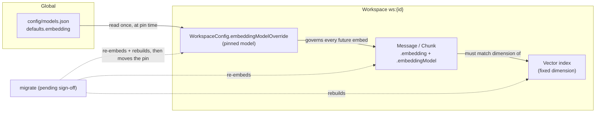
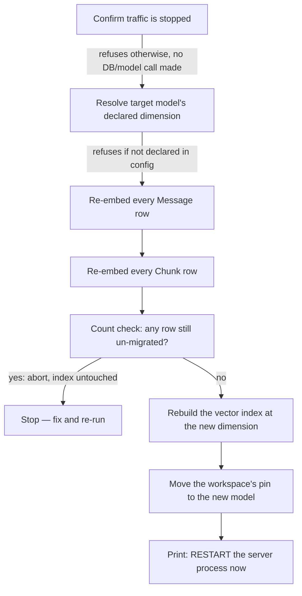
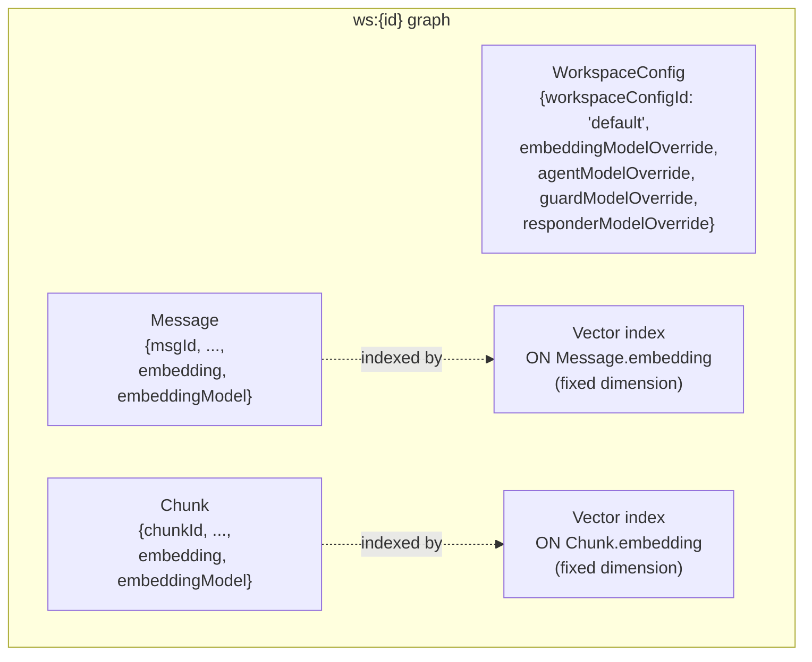

# Embedding-model migration & pinning

> **Status:** active · **Owner:** `tico` · **Tracks:** — (M6+)

## Who this is for

The **operator** running a `falkor-chat` deployment — the person who edits `config/models.json`,
starts/stops the server process(es), and decides when a workspace's embedding model needs to
change (most often: the currently-configured model is too heavy for the host, or a smaller/better
replacement has been found). No graph or Python knowledge is assumed; where the underlying data
shape matters, it's explained here rather than pointed at source.

## Overview

Every message and every ingested-document chunk in `falkor-chat` is stored with a vector
**embedding** — a numeric fingerprint of its text, produced by one specific embedding model. Two
things depend on that model staying consistent for a given workspace:

- **Every vector in a workspace's vector index must come from the same model.** Mixing vectors
  from two different models in one search index silently corrupts similarity search — old and new
  vectors just aren't comparable, even if they happen to have the same length.
- **The vector index itself is built for one fixed dimension** (a length, e.g. 1024 numbers per
  vector). A model swap that changes the output length leaves old vectors unsearchable — accepted
  on write, but silently invisible to search.

This deployment's embedding model is a **global default** in `config/models.json`. Changing that
default (a config edit + restart, `falkor-chat/docs/DESIGN.md` §1.3) is easy — but by itself it
does nothing to fix already-stored vectors, and it would silently change behavior for *every*
existing workspace at once unless something stops it. Two capabilities close that gap:

- **`pin`** — records a workspace's embedding model as an explicit, permanent choice, so a later
  global-default change can never silently affect it. **Shipped and reviewed**, and wired into
  every real-workspace creation path (`start_server.sh`, `start_demo.sh`, `start_agent_team.sh`
  all go through `create_workspace.sh`) — so it fires automatically for any workspace created from
  here on. **It has not yet been run retroactively against any workspace that already existed
  before this feature shipped** — see the callout in Walkthrough 1 before assuming your existing
  workspaces are protected.
- **`migrate`** — re-embeds a workspace's existing data to a new model and rebuilds its vector
  index to match. **Code-complete, extensively tested, but not yet signed off** — see the callout
  in its walkthrough below before relying on it for anything that matters.



## Walkthroughs

### 1. Pinning a workspace's embedding model (shipped)

Every workspace created through the canonical entry point is pinned automatically — there is
normally nothing to do:

```bash
EMBEDDING_DIM=1024 ./scripts/create_workspace.sh acme
```

`create_workspace.sh` runs the existing schema setup, then pins the new workspace's embedding
model to whatever the global default is *at that moment*. From then on, that workspace keeps using
that model even if `config/models.json`'s default later changes — a global swap only ever affects
workspaces created *after* the swap, never ones that already existed.

You can also pin (or re-check) one or more workspaces directly:

```bash
./scripts/pin_workspace_embedding_model.sh acme demo
```

What happens:

- If a workspace is **already pinned**, this is a no-op — it prints the existing model and leaves
  it untouched. Safe to re-run any time, on any workspace, without risk of accidentally moving an
  existing pin.
- If it is **not yet pinned**, it records the current global default as that workspace's
  permanent override.
- If the model configuration itself can't be read (e.g. a missing/invalid provider config file),
  pinning **degrades to a printed warning and does nothing** — it never fails the surrounding
  script. This is deliberate: some workspaces (see the FAQ) are meant to run without that
  configuration present at all, and a hard failure there would break them.

> ⚠️ **Every real workspace that existed before this feature shipped is still unprotected today.**
> The one-time sweep to pin them retroactively (`docs/plans/embedding-migration.md` §5 step 3) is
> a designed, but not-yet-run, runbook step — as of this writing, `ws:acme`, `ws:demo`, `ws:eval`,
> and `ws:agent-team` all have zero `WorkspaceConfig` node, i.e. none is pinned. Editing
> `config/models.json`'s global default today would silently change embedding behavior for every
> one of them on their next write. Until the sweep runs, `pin` only reliably protects a workspace
> created *after* this feature shipped — run it explicitly against your existing workspaces first:
>
> ```bash
> ./scripts/pin_workspace_embedding_model.sh acme demo eval agent-team
> ```

### 2. Migrating a workspace to a new embedding model (⚠️ pending sign-off)

> **This capability is code-complete and has an extensive automated test suite behind it
> (idempotent-resume, mid-batch-crash recovery, and more — see Configuration & integration below),
> but it has not yet cleared its independent review gate.** Treat everything below as "this is how
> it's designed to work," not yet as "this is safe to run against anything you can't afford to
> lose." Check the current gate status in `falkor-chat/docs/plans/embedding-migration-coordination.md`
> before running this against real data, and prefer running it against a disposable/validation
> workspace first regardless (see Walkthrough 3).

Once a workspace needs to move to a genuinely different model — most often because the old one no
longer fits the host's memory budget — `migrate` re-embeds every message and chunk, rebuilds the
workspace's vector index to the new model's dimension, and moves the workspace's pin to the new
model, all in one operation.

**Before running it: stop traffic.** Migration requires a brief, full outage of that workspace —
stop the `falkorchat.app` process serving it first. The tool refuses to touch anything (no
database connection, no model-config read) until you confirm this:

```bash
./scripts/migrate_embeddings.sh acme lmstudio/granite-embedding-278m-multilingual \
    --i-have-stopped-traffic
```

(Omit the flag and run it from a terminal, and it prompts you interactively instead.)

What happens, in order:



A few properties worth knowing about, all directly relevant to running this safely:

- **It resumes, it never restarts from zero.** If it's interrupted at any point — a crash, a
  killed process, a rebooted host — re-running the exact same command only processes what's left
  undone. A fully-migrated workspace re-run **re-embeds zero rows** — but it is idempotent in
  effect, not a no-op in execution: it still drops and rebuilds both vector indexes (briefly
  leaving that label unsearchable) and still ends with the same mandatory restart instruction.
  Never skip the restart on a re-run just because "nothing happened" — the index rebuild alone is
  reason enough to do it.
- **The vector index is never rebuilt until every row is confirmed migrated.** If anything is left
  over after the re-embed pass, the tool aborts *before* touching the index — you're never left
  with an index rebuilt against partially-migrated data.
- **You must restart the server process afterward**, before resuming traffic. The tool prints this
  as its last line; it cannot do this step for you, since it isn't the process that's running.
  Skipping it leaves the running process comparing new writes against the old, now-stale vector
  dimension.
- **A row that vanishes mid-migration (deleted concurrently) is skipped and logged, not treated as
  a failure** — it's simply not counted as migrated, and doesn't block the rest of the run.

### 3. Validating a candidate model before migrating production data

Before pointing `migrate` at any workspace that matters, validate the candidate model's retrieval
quality first — `model-bench`'s `embedder-graphrag-retrieval` pack is built for exactly this: it
runs a candidate embedding model against a disposable evaluation dataset and compares recall/MRR
against a baseline, without touching any real workspace. Once a candidate looks good there, the
recommended path is to migrate the dedicated evaluation workspace (`ws:eval`) first, confirm its
existing recall/MRR check still holds, and only then consider a production workspace. See the
model-bench manual for how to run that comparison.

## Graph data structures

Two pieces of graph state, both inside each workspace's own graph (`ws:{id}`), carry this
feature's data — nothing about it is global or cross-workspace:



- **`WorkspaceConfig`** is a one-row-per-workspace singleton holding the pin. It's the same node
  that already carries the (unrelated) agent/guard/responder model overrides — `pin`/`migrate`
  only ever touch the `embeddingModelOverride` property on it, always reading the other three back
  first and writing them unchanged, so pinning or migrating a workspace's embedding model can never
  accidentally clear its agent/guard/responder choices.
- **`Message`/`Chunk` rows carry two properties each: `embedding` (the vector itself) and
  `embeddingModel` (which model produced it).** `migrate` uses the second property to know which
  rows are already done — this is exactly what makes resuming after an interruption safe: a
  re-run's very first read only ever sees rows still stamped with the *old* model.
  `pin` never touches either property; it only ever writes the workspace-level override.
  There is no global, cross-workspace store of embeddings or model choices anywhere — every one of
  these lives entirely inside its own workspace's graph.
- **The vector index's dimension is separate, structural state** — set once, at index-creation
  time, and otherwise fixed. `migrate` is the only thing that ever changes it for an existing
  workspace (a guarded drop-and-recreate, done only after every row is confirmed re-embedded).

## Configuration & integration

| Setting | Where | Purpose |
|---|---|---|
| `config/models.json` → `defaults.embedding` | global config file | The model every *newly pinned* workspace inherits. Editing this + restarting changes the global default — it never touches an already-pinned workspace. |
| `config/models.json` → `models.<ref>.dim` | global config file | Must be declared for any model `migrate` targets — the tool refuses to start against an undeclared dimension rather than guess. |
| `EMBEDDING_DIM` | env var, `create_workspace.sh` / `bootstrap_schema.sh` | Sets a *brand-new* workspace's vector index dimension at creation time (default `1536`). Unrelated to `migrate`, which reads the target dimension from `models.json` instead and rebuilds the index to match. |
| `FALKORCHAT_OPENCODE_CONFIG` | env var, both scripts | The shared model-provider config `pin`/`migrate` need to resolve a real model. Missing/invalid: `pin` degrades to a warning and no-op; `migrate` treats this as fatal (it has no way to re-embed without a real model). |
| `--batch-size` | `migrate_embeddings.sh` flag | Rows read per page during re-embedding (default 50). Larger batches mean fewer round trips but a longer window before progress is checkpointed. |
| `--i-have-stopped-traffic` | `migrate_embeddings.sh` flag | Required confirmation that the workspace's server process is stopped; omit it in an interactive terminal to be prompted instead. |

**Integration points:**

- **`create_workspace.sh` is the canonical entry point for any real, live-served workspace** — it
  wraps schema setup and pinning together so a new workspace is never accidentally left unpinned.
  A handful of throwaway/offline workspaces (e.g. the test suite's own scratch workspace) are a
  deliberate carve-out and keep calling the lower-level schema-setup script directly — they don't
  need FR-1/FR-2's safety net and shouldn't gain a hard dependency on the model-provider config.
- **`model-bench`'s `embedder-graphrag-retrieval` pack** is the recommended way to validate a
  candidate model's retrieval quality before running `migrate` against anything that matters (see
  Walkthrough 3) — this manual and the model-bench manual are meant to be read together when
  planning a model swap.
- **The `EmbeddingDimensionError` guard** (an existing safety check, unrelated to this feature but
  load-bearing alongside it) is what makes an *un-migrated* workspace fail loudly rather than
  silently after a global default changes: if a workspace's pin is somehow missing and it tries to
  embed against a index of the wrong dimension, the write is rejected rather than silently
  corrupting the index.

## FAQ / troubleshooting

**Is it safe to run `migrate` against a production workspace today?**
Not yet recommended — it hasn't cleared its independent review gate (see the callout in
Walkthrough 2). It has passed an extensive automated test suite, including forced mid-batch-crash
and interrupted-resume scenarios, but hasn't yet had an independent specialist review of the
implementation itself. Check `falkor-chat/docs/plans/embedding-migration-coordination.md` for the
current gate status before relying on it for real data.

**Is my existing workspace already protected against a global default change?**
Only if someone has already pinned it explicitly — check by asking whether `pin` reported a
no-op (already pinned) or a fresh pin the last time it ran against that workspace id. As of this
writing, no workspace created before this feature shipped has been swept — see the callout in
Walkthrough 1. When in doubt, just re-run `pin_workspace_embedding_model.sh <wsId>`; it's always
safe and tells you which case you're in.

**I ran `pin` and nothing seemed to happen — is that a bug?**
No — if the workspace was already pinned, `pin` is designed to be a silent no-op (it prints the
existing model and returns). Re-running it repeatedly is always safe.

**Why didn't pinning fail when my model-provider config file was missing?**
By design. Some workspaces (notably ones running with `FALKORCHAT_ENABLE_AGENT=0`) are meant to
operate with no model-provider configuration present at all. `pin` degrades to a printed warning
rather than a hard failure so it never breaks that mode — but it also means the workspace stays
unprotected by FR-1/FR-2's safety net until you re-run pinning once a valid config is available.

**Can I migrate a workspace while its server keeps running?**
No — `migrate` requires a brief, full outage and won't touch the database until you confirm
traffic is stopped. Zero-downtime migration is explicitly out of scope for this capability.

**What happens if `migrate` is interrupted halfway through?**
Just re-run the exact same command. Every step is keyed off what's actually stored in the graph,
not off any local progress file, so a re-run only processes what's genuinely left undone —
including safely resuming from a crash between rebuilding the two vector indexes.

**Does `migrate` change anything about `Message`/`Chunk` other than the embedding itself?**
It also stamps an `embeddingModel` property on each re-embedded row — this is what lets it (and
any future migration) tell which rows are already done. It doesn't touch any other content or
metadata on those rows.
