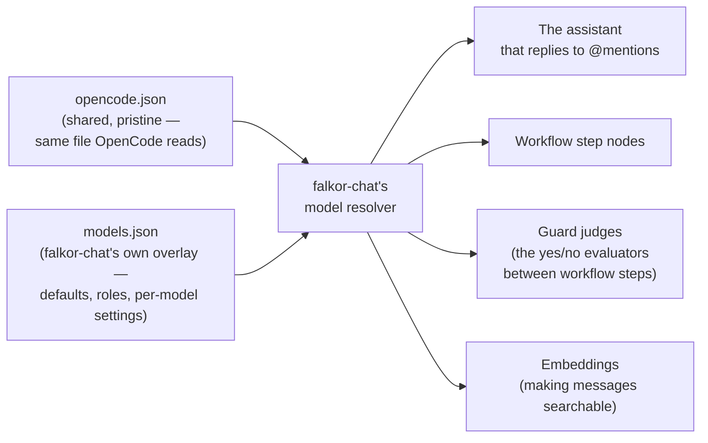
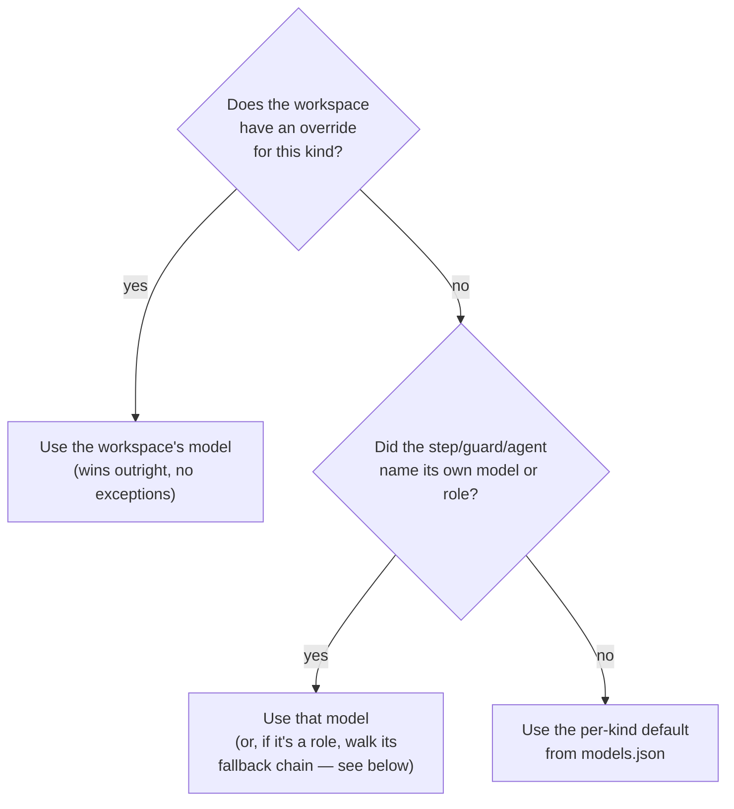

# LLM Provider & Model Configuration — Manual

> **Status:** active · **Owner:** `tico` · **Tracks:** K-042 (M4)

## Who this is for

Whoever hand-edits falkor-chat's model configuration: deciding which LLM/embedding models the
system uses, adding a new provider (a new LM Studio box, a LAN host, a cloud account), giving a
particular workflow step or judge a different model than everything else, and figuring out which
model actually answered a given run. If you're authoring a workflow definition's flowchart itself
(steps, transitions, guards beyond just naming a model), see `docs/manuals/workflows.md` — this
manual covers the one field there (`config.model`) that this feature owns.

## Overview

Every place falkor-chat calls an LLM or an embedding model goes through **one shared mechanism**,
fed by **two hand-edited files**. There is no "model" setting anywhere else — not an environment
variable, not a database row you'd find by browsing.



- **The shared file** (`opencode.json`, path set by `FALKORCHAT_OPENCODE_CONFIG`) is the same
  format — and can be the very same file — OpenCode itself reads. It declares **providers**
  (an endpoint + credentials) and, under each provider, the models available there. falkor-chat
  never writes to this file and doesn't require you to edit it for falkor-chat's sake — if you
  already have one for OpenCode, point falkor-chat at it as-is.
- **falkor-chat's own file** (`models.json`, path set by `FALKORCHAT_MODEL_CONFIG`, defaults to
  the shipped `config/models.json` if you don't set the variable) is where falkor-chat-specific
  choices live: which model each of the four places above uses **by default**, per-model settings
  like request timeout, and (optional) **roles** — a stable name you can re-point at a different
  model later without touching a workflow definition.
- A model is always named the same way everywhere: **`<provider>/<model-id>`** — e.g.
  `lmstudio/qwen/qwen3-4b-2507`. The provider id must match one declared in the shared file.
- **Changes take effect on server restart** — there is no live reload. Edit a file, restart the
  server, done.

**Who can name a model, and what wins when more than one does.** Any of the four places may name
its own model (or a role); any of them may also name nothing, in which case it falls back to the
default for its kind. Independently, a **workspace** can force everything running in it onto a
specific model, overriding everyone's own choice:



The workspace override is a **hard cap** — even a workflow step that explicitly names a model can
be overruled by it. That's deliberate (a workspace admin might need to force everything onto one
model temporarily), and it's why every workflow run keeps a record of **which concrete model
actually answered** (Walkthrough 7) — an overruled choice stays visible instead of silently
disappearing.

## Walkthroughs

### 1. First-time setup — pointing falkor-chat at your two files

1. If you don't already have an `opencode.json`, copy `config/opencode.example.json` and edit it:
   one `provider.<id>` block per place you can reach a model (see Walkthrough 2). If you already
   use OpenCode, you can point falkor-chat straight at your existing file — no changes needed.
2. Set `FALKORCHAT_OPENCODE_CONFIG` to that file's path. This is **required** the moment you turn
   on the AI assistant (`FALKORCHAT_ENABLE_AGENT=1`) or workflows
   (`FALKORCHAT_WORKFLOW_ENABLED=1`) — there's no built-in default. (`./scripts/start_server.sh`
   sets a convenience default of `$HOME/.config/opencode/opencode.json` for local dev, so if
   you're using that script and already have an OpenCode config there, you don't need to do
   anything.)
3. Optionally set `FALKORCHAT_MODEL_CONFIG` to your own overlay file. If you skip this, falkor-chat
   uses the shipped `config/models.json` as-is.
4. Start the server. If a file is missing, unreadable, or malformed, **the server refuses to
   start** and the error names the environment variable, the path it tried, and the shipped
   example to copy from — it never starts up silently misconfigured.

### 2. Declaring a provider and its models (the shared file)

Add a block under `provider` in the shared `opencode.json`:

```json
"provider": {
  "lmstudio": {
    "npm": "@ai-sdk/openai-compatible",
    "name": "LM Studio (local)",
    "options": { "baseURL": "http://localhost:1234/v1" },
    "models": { "qwen/qwen3-4b-2507": { "name": "Qwen3 4B 2507 (local)" } }
  },
  "openai": {
    "npm": "@ai-sdk/openai",
    "name": "OpenAI",
    "options": {
      "baseURL": "https://api.openai.com/v1",
      "apiKey": "{env:OPENAI_API_KEY}"
    },
    "models": { "gpt-4o-mini": { "name": "GPT-4o mini" } }
  }
}
```

A few things worth knowing:

- **Never write a secret literally into the file.** Use `{env:SOME_VAR}` (reads an environment
  variable at startup) or `{file:/path/to/secret}` (reads a file). falkor-chat resolves these the
  same way OpenCode does. If the variable/file isn't there, startup fails naming exactly what was
  missing and where it was referenced.
- **The `models` map under a provider is informational, not an allow-list.** You can call any
  model id your endpoint actually serves — falkor-chat doesn't check it against what's listed
  here. Only the *provider id* has to exist.
- **A local LM Studio `baseURL` without `/v1` is handled for you.** falkor-chat normalizes it
  automatically (LM Studio's convention omits `/v1`; a straight OpenAI/Anthropic-style URL that
  already ends in `/v1` is left alone). One `INFO` line per provider at startup tells you the URL
  it actually resolved to, so if a model call is going to the wrong place, that's the first thing
  to check. If the automatic rule ever guesses wrong for some endpoint, set that provider's
  `baseURL` explicitly in your **overlay** file (`providers.<id>.baseURL`) — it always wins over
  the automatic rule, and you don't have to touch the shared file to do it.

**Three kinds of provider are supported today:** a local OpenAI-compatible endpoint (LM Studio), a
second OpenAI-compatible host anywhere on your network, and hosted cloud providers — OpenAI
natively, and Anthropic via its OpenAI-compatible base URL. A provider declared with any other
protocol fails loudly by name at startup rather than silently sending the wrong shape of request.

### 3. Setting per-kind defaults and per-model settings (the overlay)

In `models.json`:

```json
{
  "defaults": {
    "agent": "lmstudio/qwen/qwen3-4b-2507",
    "step": "lmstudio/qwen/qwen3-4b-2507",
    "guard": "lmstudio/qwen/qwen3-4b-2507",
    "embedding": "lmstudio/text-embedding-qwen3-embedding-0.6b"
  },
  "timeouts": { "agent": 180, "step": 180, "guard": 180, "embedding": 30 },
  "models": {
    "lmstudio/text-embedding-qwen3-embedding-0.6b": { "dim": 1024 },
    "openai/gpt-4o-mini": { "timeout": 60, "temperature": 0.2 }
  }
}
```

- `defaults` is what each of the four places uses when it doesn't name a model of its own.
- `timeouts` sets a request timeout per kind; `models.<ref>` can override settings (timeout,
  temperature, and other generation parameters your provider accepts) for one specific model.
- For an **embedding** model, declare its `dim` (vector dimension) here — falkor-chat uses it to
  catch a mismatch against a workspace's search index before it ever writes a bad vector
  (Walkthrough 8).

### 4. Naming a specific model for one workflow step or guard

A workflow step or an `llm`-kind guard names its own model inside the workflow definition itself
(the flowchart JSON — see `docs/manuals/workflows.md` for the rest of that authoring process):

```json
{ "key": "summarize", "type": "agent", "config": { "model": "openai/gpt-4o-mini" } }
```

```json
{ "kind": "llm", "text": "is this enough information to proceed?", "model": "lmstudio/qwen/qwen3-4b-2507" }
```

Leave `model` out and that step or guard uses its kind's default (Walkthrough 3) instead. This is
how you give an expensive reasoning step a strong model while a routine judging step stays on a
cheap, fast one.

**A model or role a step names is checked when the workflow definition is published, not only
when it runs** — publishing fails immediately, naming the step and the unresolvable name, if it
can't be matched against your providers (Walkthrough 8).

### 5. Roles — swapping a model without republishing a workflow

Workflow definitions can't be edited in place once published (only republished as a new version —
see `docs/manuals/workflows.md`), so naming a concrete model directly means a model swap requires
a new workflow version. A **role** avoids that: a stable name you declare once in the overlay and
map to one or more models, and any step or guard can reference the role name instead of a model.

```json
"roles": {
  "reasoning": { "models": ["openai/gpt-4o-mini", "lmstudio/qwen/qwen3-4b-2507"] }
}
```

A step names the role directly — `"config": {"model": "reasoning"}` — no `/` in the name is what
tells falkor-chat it's a role rather than a `provider/model` reference. To swap what `reasoning`
means, edit the mapping in `models.json` and restart the server; every workflow that names the
role picks up the new model on its next run, with no republish.

**The list under a role doubles as a fallback chain.** If the first model's call fails (its
endpoint is down, or it errors), falkor-chat automatically tries the next one in the list, and the
one after that, before giving up. This is different from an *unresolvable* name (Walkthrough 8,
which always fails loudly, never falls back) — a fallback chain is a resilience feature you opt
into on purpose, for a model you expect might occasionally be unreachable.

### 6. Setting a workspace override

> **Heads up: there's no web UI or REST endpoint for this today.** A workspace override is set by
> running a Cypher write directly against the workspace's graph. Treat this as an operator-level
> action, not something to hand to an end user.

The four override slots are named a little differently from the four "kinds" described elsewhere
in this manual — this is the single easiest thing to get backwards, so read the table before
writing the query:

| To override... | ...set this property |
|---|---|
| the assistant that replies to `@mention`s | `agentModelOverride` |
| workflow step nodes | `agentModelOverride` |
| guard judges | `guardModelOverride` |
| embeddings | `embeddingModelOverride` |

> Yes — both "the `@mention` assistant" and "workflow step nodes" land on the **same**
> `agentModelOverride` property (there's also an unused `responderModelOverride` slot reserved
> internally; don't use it). If you only intend to override one of the two, there's currently no
> way to separate them at the workspace level — the override is coarser than the per-kind default
> is.

```cypher
MERGE (c:WorkspaceConfig {workspaceConfigId: 'default'})
SET c.agentModelOverride     = 'openai/gpt-4o-mini',
    c.guardModelOverride     = null,
    c.embeddingModelOverride = null,
    c.modelOverrideUpdatedAt = timestamp(),
    c.modelOverrideUpdatedBy = 'you@example.com'
```

Run it against the target workspace's own graph (`ws:<workspaceId>`), not the shared `reference`
graph. Setting a property to `null` **clears** that kind's override (falls back to whatever the
step/guard/agent would otherwise have used); leaving a property out of the `SET` list entirely
does *not* clear it — always name all four explicitly, as above, so you know exactly what state
you're leaving them in. Takes effect on the workspace's very next run — no restart needed (this
one *is* read live, unlike the two config files).

### 7. Checking which concrete model actually answered a run

Because a role can expand to a fallback chain and a workspace override can silently overrule a
step's own choice, falkor-chat records **the concrete model that actually ran** on every workflow
step, so nothing is invisible after the fact.

```
GET /workflow-runs/{run_id}/step-runs
```

Each step in the response carries three extra fields:

- `resolvedModel` — the concrete `provider/model` that answered.
- `modelSource` — which rule decided it: `workspace`, `step` (its own named choice, including a
  role), or `default` (the per-kind default).
- `modelFallback` — `true` if a role's fallback chain had to skip past the first model to get an
  answer; absent (not `false`) when there's nothing to report.

> **This only exists for workflow runs.** If `FALKORCHAT_WORKFLOW_ENABLED` is off, an `@mention`
> reply goes through the plain assistant path directly (no workflow run underneath it), and there
> is currently **no equivalent record** of which model answered that reply — nothing in the web UI
> or the API surfaces it. If you need per-reply model visibility, that currently means running
> with workflows enabled.

The web UI's run detail panel ("Show trace") is a **different, debug-only** feature — it's empty
for most day-to-day runs (see `docs/manuals/workflows.md`). `resolvedModel`/`modelSource`/
`modelFallback` are not shown there or anywhere in the web UI today; the API above is the only way
to read them.

### 8. What happens when something's wrong

- **A workflow definition names a model or role that doesn't resolve.** Publishing it fails
  immediately (before anything is saved) with an error naming the offending step and the
  unresolvable name. Fix the name (or declare the missing provider/role) and publish again.
- **A model resolves, but fails when actually called** (endpoint down, request errors) and it's
  **not** a role with a fallback chain. The run stops in a `failed` state with the cause in its
  error message. falkor-chat never silently substitutes a different model on your behalf — if you
  want that resilience, declare the model as a role with a fallback chain (Walkthrough 5) on
  purpose.
- **An embedding model's dimension doesn't match a workspace's search index.** falkor-chat refuses
  to write anything rather than silently writing a vector that will never be found in a search —
  the failure names the model, its declared dimension, and the workspace's index dimension.
- **A config file is missing, unreadable, or malformed at startup**, or **an old-style environment
  variable is still set** (`FALKORCHAT_LLM_MODEL`, `FALKORCHAT_LLM_BASE_URL`,
  `FALKORCHAT_EMBEDDING_BASE_URL`, `FALKORCHAT_EMBEDDING_MODEL` — replaced by the two files
  described in this manual). Either way the server refuses to start, and the error says exactly
  what's wrong and what to do about it.

## FAQ / troubleshooting

**I edited `models.json` and nothing changed.** Both config files are read once at server startup
— restart the server. (The one exception is a workspace override, which is read live — see
Walkthrough 6.)

**Why did my workflow publish get rejected?** Most likely a step or guard names a model or role
that isn't declared anywhere reachable — check the error message, it names the exact step and
identifier. See Walkthrough 8.

**My run says `failed` instead of trying another model — I thought there was a fallback?**
Fallback only happens for a **role** with more than one model listed (Walkthrough 5). A model
named directly, or a role/model that can't be resolved at all, never falls back — that's
deliberate, so a bad name is never silently papered over.

**I want to see which model answered a specific `@mention` reply, and workflows are off.** There's
currently no way to see that — see the callout in Walkthrough 7. Turning on
`FALKORCHAT_WORKFLOW_ENABLED` gets you the per-step record; there's no equivalent for the plain
responder path.

**I set a workspace override but only wanted to affect the assistant, not workflow steps (or vice
versa).** You can't — they share the same `agentModelOverride` slot today (Walkthrough 6's table).

**Does this work the same way when the server runs in Docker?** The two config files and the
model-resolution logic don't change under Docker — but the *paths and endpoints* you reference
inside them do (a `localhost:1234` LM Studio isn't reachable as `localhost` from inside a
container). This hasn't been verified end-to-end against a real Docker build yet — see backlog
item K-043 if you hit something that doesn't work as described here in that setup.
