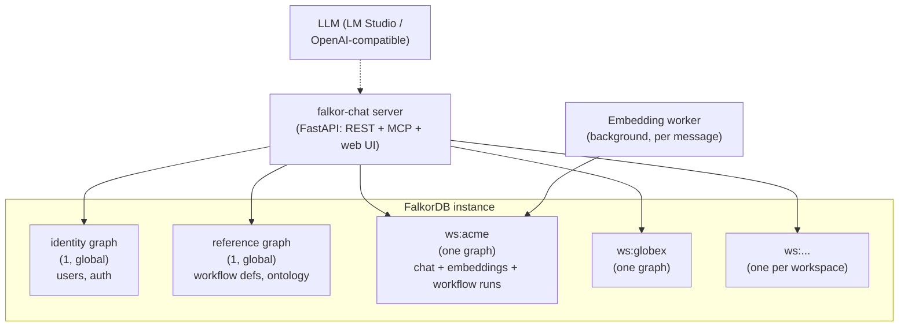
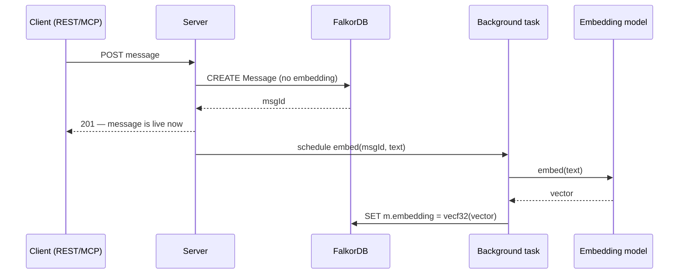

# falkor-chat — Operations & Administration Manual

> **Status:** active · **Owner:** `tico` · **Tracks:** K-007, K-011, K-013 (M2)

## Who this is for

**System administrators and operators running a falkor-chat instance** — not the people chatting
in it. You're comfortable with Docker, `redis-cli`, and reading Cypher. This manual covers
deploying the stack, standing up and sizing workspaces, how the GraphRAG (vector search) subsystem
works under the hood and how to keep it healthy, capacity planning, and diagnostics.

Two things it deliberately does **not** cover, because another manual already owns them — follow
the link rather than looking here:
- **Which LLM/embedding model answers, and how to configure providers/roles/overrides** →
  `docs/manuals/llm-provider-config.md`. This manual only covers the *vector-index and retrieval
  plumbing* around embeddings — index dimension, RAM, diagnostics — not model selection.
- **Authoring or running a workflow definition** → `docs/manuals/workflows.md`.

## Overview

falkor-chat has no separate database, search index, or job queue — **FalkorDB is the whole
backing store.** Operating falkor-chat is therefore mostly operating one FalkorDB instance well:
sizing it, indexing it correctly, and knowing how to look inside it when something's wrong.



Every workspace is its **own graph key** (`ws:{id}`) — that's the unit you size, back up, and
scale by. `identity` and `reference` are small, shared, read-mostly graphs. There is no
`workspaceId` column to filter on anywhere; isolation is structural, not a `WHERE` clause.

---

## Walkthroughs

### 1. Deploying the stack

Two supported paths — pick one, don't run both against the same data at once (they share the
same Docker volume and Redis port):

**A — Docker Compose** (`compose.yaml`): FalkorDB + the server together.
```bash
docker compose up --build     # FalkorDB :6379/:3000 + server at :8000
docker compose down           # stop — NEVER `down -v` (the volume is shared, persistent data)
```
Notable details baked into the compose file:
- The FalkorDB image's actual data directory is `/var/lib/falkordb/data`, **not** `/data` —
  mounting at `/data` silently persists nothing.
- The server container reaches FalkorDB via the Compose service name `falkordb`, not `localhost`.
- If you turn on the AI agent (`FALKORCHAT_ENABLE_AGENT=1`) with an LM Studio instance running on
  the **host** machine, the container needs `host.docker.internal` (wired via `extra_hosts` in
  the compose file already) — a bare `localhost` inside the container is the container itself.
- The shared model-provider file (`opencode.json`) is **bind-mounted read-only** from the host —
  falkor-chat never writes to it. Override `FALKORCHAT_OPENCODE_CONFIG_HOST` if yours lives
  somewhere other than `$HOME/.config/opencode/opencode.json`.

**B — Scripts** (`./scripts/start_falkordb.sh` + `./scripts/start_server.sh` / manual `uvicorn`):
the faster dev loop, same FalkorDB image/ports/volume as Compose — **stop `falkordb-dev` before
switching to Compose**, and vice versa, or you'll run two engines on one volume and corrupt it.

Either way, verify the engine is actually up before doing anything else:
```bash
redis-cli ping                 # → PONG
redis-cli MODULE LIST          # → graph (ver 41811), vectorset
redis-cli GRAPH.LIST           # → your workspace graphs
```

### 2. Bootstrapping a workspace — and the one decision you can't undo

```bash
./scripts/bootstrap_schema.sh <workspaceId> [<workspaceId> ...]
EMBEDDING_DIM=1024 ./scripts/bootstrap_schema.sh acme    # GraphRAG dimension for this lab's model
```
Idempotent, and safe to re-run with new workspace IDs (it always also touches `reference`, but
only with `CREATE INDEX`/`CONSTRAINT` statements — never data-mutating). It creates every range
index, uniqueness constraint, full-text index, and **vector index** for the workspace.

**The vector index's dimension is fixed forever the moment it's created.** `EMBEDDING_DIM`
(default `1536` if unset) becomes part of the `CREATE VECTOR INDEX ... OPTIONS {dimension: N}`
statement. Re-running bootstrap later with a *different* `EMBEDDING_DIM` does **not** change it —
FalkorDB rejects re-creating an already-indexed property (`Attribute 'embedding' is already
indexed`) and silently keeps the original dimension. Because `bootstrap_schema.sh` uses
`redis-cli`, which exits `0` even on that Redis-level error, a `set -e` script will sail right
past it without complaint. **The only way to change a workspace's embedding dimension is to drop
and recreate its vector index** — which, in practice, means starting the workspace over.

**Decide the dimension before you create a single workspace in production.** This lab's shipped
default model (Qwen3-Embedding-0.6B via LM Studio) is 1024-dim — set `EMBEDDING_DIM=1024`
explicitly; don't rely on the `1536` fallback unless that's genuinely your model. Confirm what
actually landed:
```bash
redis-cli GRAPH.QUERY ws:acme "CALL db.indexes()"
```
Look for the `Message` row's `types`/`options` columns — a `VECTOR`-typed entry carries
`{dimension, similarityFunction, M, efConstruction, efRuntime}`.

Then run the full query suite once against a throwaway workspace to prove the instance behaves as
expected end to end:
```bash
./scripts/test_queries.sh
```
> ⚠️ This **deletes the `reference` graph** at teardown, wiping published workflow definitions
> (workspace snapshots survive). If you have workflows seeded, re-run `seed_workflows.sh <wsId>`
> afterward, or check drift first with `verify_workflows.sh <wsId>`.

### 3. How the GraphRAG vector index actually works

Every message gets an `embedding` property (a `vecf32`-encoded vector), and the workspace has a
**vector index** over that property — FalkorDB's HNSW-based approximate nearest-neighbor index,
declared as DDL, not a procedure call:
```sql
CREATE VECTOR INDEX FOR (n:Message) ON (n.embedding)
OPTIONS {dimension: 1024, similarityFunction: 'cosine'}
```
A second vector index exists on `Chunk.embedding` too (bootstrapped for a future
document/chunk-ingestion corpus) — but **nothing writes `Chunk` nodes today**; it's schema-ready,
not in use. Every embedding this deployment produces today lands on `Message` nodes only.

**A vector index is scoped to exactly one `(label, property)` pair, and a single retrieval call
searches exactly one of them.** `CALL db.idx.vector.queryNodes('Message', 'embedding', $k,
$qVec)` takes the label as its first argument — there's no multi-label form. If you ever populate
`Chunk` too, searching both means two separate `queryNodes` calls merged in Cypher or at the app
layer, not one call.

**Score is cosine *distance*, not similarity** — `0` = identical, and results should always be
read `ORDER BY score ASC` (most similar first). Getting this backwards is the single easiest
mistake when hand-writing a diagnostic query against this index.

**ANN recall is approximate.** `queryNodes(..., k, ...)` returns *up to* `k` rows, not exactly
`k` — a small or sparse index may legitimately return fewer. Don't treat "always exactly k rows"
as an invariant when building tooling around it.

### 4. The embedding pipeline — how a message actually gets embedded

Posting a message and embedding it are **two separate writes**, deliberately decoupled:



The write path never waits on the embedding model — a message is always readable the instant it's
posted, regardless of the embedder's latency or health. This matters operationally: **an
embedding-model outage degrades search, it does not degrade chat.** Messages keep flowing; they
just won't be vector-searchable until the embedder is back up and the backlog catches up (there is
no queue/retry mechanism beyond the single attempt scheduled at post time today — a message whose
embed attempt fails simply stays unembedded until something re-embeds it).

**Before writing anything, the worker checks two things and refuses (no HTTP call, no write) if
either fails:**
1. The configured embedding model's *declared* dimension vs. the workspace's *actual* vector-index
   dimension (introspected live via `CALL db.indexes()`, cached per `(workspace, label)` for the
   process lifetime — a `None`/no-index result is deliberately never cached, since a workspace can
   get bootstrapped mid-process-life).
2. After the model responds: the *returned* vector's length against the same expected dimension.

This exists because of a sharp engine quirk: **a wrong-dimension `SET n.embedding = vecf32([...])`
is silently accepted by FalkorDB** (`Properties set: 1`, no error) — but the node then permanently
drops out of the ANN index and never appears in a `queryNodes` result again, with nothing in the
logs to tell you why a message is unfindable. The two pre-write checks exist specifically to make
that failure mode loud (`EmbeddingDimensionError`, naming the model, both dimensions, and the
`msgId`) instead of silent.

Failures are logged and swallowed at the background-task boundary — they never propagate back to
whoever posted the message.

**Backfilling embeddings for messages that predate embedding, or that failed once:** there's no
dedicated backfill script for embeddings specifically (contrast `backfill_thread_ids.sh`, which
backfills a different field). Re-embedding an already-embedded message is a plain idempotent `SET`
— running the same `set_embedding` write again just overwrites the vector.

### 5. Tuning the retrieval query

The canonical hybrid-retrieval query (`docs/QUERIES.md` §6) has three operator-relevant knobs:

- **`k`** — how many ANN neighbors seed the result before graph scoping narrows them. The AI
  responder defaults to `k=10`. Larger `k` costs more per query and doesn't guarantee more useful
  context; it's a recall/cost trade, not a correctness one.
- **Channel scoping** — the responder always scopes retrieval to the channel the question was
  asked in (a `MATCH (c:Channel {channelId: ...})` clause). Dropping that clause searches the
  whole workspace instead — useful for a diagnostic query, risky for a live answer (context from
  an unrelated channel could leak into an answer).
- **Per-query `TIMEOUT` override.** The deployment-wide default (`TIMEOUT=1000` ms) is tuned for
  ordinary chat CRUD, not a hybrid vector+traversal read on a large workspace. GraphRAG reads pass
  a per-call override instead (`g.ro_query(q, params=..., timeout=5000..10000)`) — if you're
  hand-running a retrieval query from `redis-cli` for diagnostics, remember the deployment default
  still applies unless you set `TIMEOUT` explicitly for that session.
  **Writes ignore `TIMEOUT` entirely on this build** — an oversized bulk write runs to completion
  no matter what timeout is set; bounded batch size is the only real protection there.

Retrieval reads are issued via `GRAPH.RO_QUERY`, so they're **replica-routable** if you're running
read replicas — keep replica lag in mind if a very-just-posted message needs to be in scope (route
"include my own last message" reads to the primary instead).

### 6. Capacity planning

The single biggest RAM line per message is the **vector embedding itself**, not the chat data.
Measured live (`falkordb/falkordb:edge`, `INFO memory` deltas — not `GRAPH.MEMORY USAGE`, see
Walkthrough 7):

| Profile | Per message | Per 100k-message workspace |
|---|---|---|
| Chat-core only, no embeddings | ~1.06 KB | ~101 MB |
| GraphRAG @ 1024 dims (this lab's model) | ~12.4 KB | ~1.25 GB |
| GraphRAG @ 1536 dims | ~17–18 KB | ~1.7 GB |

At 1024 dims, **~85% of the per-message footprint is the vector + its HNSW/range-index overhead**
— chat content itself is nearly free by comparison. This is the concrete reason the dimension
choice in Walkthrough 2 matters for cost, not just search behavior: dropping from 1536 to 1024
saves roughly a third of the RAM for the exact same message volume.

**Shard-packing worked example** (32 GB shard, `maxmemory` ≈ 22 GB with headroom):

| Workspace profile (100k msgs each) | Fits per 22 GB shard |
|---|---|
| Chat-core only | ~170 workspaces |
| GraphRAG @ 1024 dims | ~13 workspaces |
| GraphRAG @ 1536 dims | ~10 workspaces |

Budget from the **embedded** row for any real deployment — the chat-core floor is the lower bound,
not the target. Rule of thumb for a quick estimate: **~12.5 KB/message at 1024 dims**.

Two things not to trust for this: `GRAPH.MEMORY USAGE` under-reports vector-index memory on this
engine build (it can report `indices_sz_mb: 0` while the index demonstrably holds thousands of
vectors) — always size from `INFO memory` deltas instead. And ingestion throughput isn't the
capacity constraint in practice: bulk-loaded ingestion measured ~1,178 msg/s (single client,
256-row `UNWIND` batches including embeddings); the live REST append path measured ~614 msg/s
sustained across 16 concurrent posters (p50 24 ms / p99 41 ms) — RAM, not write throughput, is
what you'll hit first at scale.

### 7. Diagnostics toolkit

```cypher
-- What's indexed, and how (includes vector dimension/similarity — see Walkthrough 2)
CALL db.indexes() YIELD label, properties, types, entitytype, status
RETURN label, properties, types, entitytype, status ORDER BY entitytype, label

-- Constraints and their (async) status
CALL db.constraints() YIELD type, label, properties, status
RETURN type, label, properties, status ORDER BY label
```
```bash
GRAPH.LIST                                   # every graph on the instance
GRAPH.PROFILE ws:acme "<query>"              # confirm an index is actually hit —
                                              # look for "Node By Index Scan", not "NodeByLabelScan"
GRAPH.SLOWLOG ws:acme                        # recently slow queries
```

`GRAPH.CONSTRAINT CREATE` returns `PENDING` immediately, not confirmation — poll
`CALL db.constraints()` and check `status` for `OPERATIONAL` before relying on a constraint being
enforced (this matters right after a fresh bootstrap, especially in a script that immediately
starts writing).

Cross-graph edges (e.g. trying to link something in `ws:acme` to a node in `reference`) **don't
error** — `MATCH` just silently returns zero rows. If a query you expect to return something
comes back empty, check whether you accidentally wrote a pattern that spans two graph keys.

### 8. Replication, scaling, and security — current state vs. roadmap

What's live-verified and usable today:
- **Reads scale via replicas.** Primary takes writes; `GRAPH.RO_QUERY` (used by GraphRAG retrieval
  and every other read path) can route to replicas. Watch for replica lag on just-written data.
- **Tenants scale via Redis Cluster.** Each `ws:{id}` graph hashes to a cluster slot and stays
  whole on one shard — rebalance by moving slots, isolate a hot workspace onto a dedicated shard
  if it outgrows its neighbors.
- **Persistence** is RDB snapshots + AOF; choose the AOF fsync policy for your RPO. A restart
  replays AOF back into RAM — plan startup time accordingly for a large instance.

What's **designed but not yet built or verified** (tracked as M4 — "Scale & ops" in the roadmap;
don't assume any of this is live in the current deployment):
- Redis Cluster multi-shard deployment itself, Sentinel-based failover, and a backup/restore drill.
- Redis ACLs scoping `GRAPH.*` per principal (ideally per-workspace key pattern) and TLS in
  transit — **there is no authentication or per-workspace access control today.** Treat the whole
  instance as trusted-network-only until M4 lands; the MCP endpoint in particular is explicitly
  documented as unauthenticated and meant for localhost/trusted-network binding only.
- Per-workspace automated memory budgeting/shard-packing (today it's the manual arithmetic in
  Walkthrough 6, not something the system enforces for you).

### 9. Maintenance scripts — quick reference

| Script | Use it to... | Watch out for |
|---|---|---|
| `start_falkordb.sh` | Bring FalkorDB up (foreground by default; `-d` for headless) | Shares port/volume with Compose — don't run both |
| `bootstrap_schema.sh <ws>...` | Create/verify indexes, constraints, vector index for one or more workspaces | Vector dimension is a one-way door (Walkthrough 2) |
| `test_queries.sh` | End-to-end query suite against a live instance | **Deletes `reference`** at teardown — re-seed workflows after |
| `backfill_thread_ids.sh <ws>...` | One-off: stamp `Message.threadId` on pre-K-007 messages | Idempotent — safe to re-run |
| `load_test.sh` | Load-test the append path + `GRAPH.PROFILE` the four hot reads + measure RAM delta | Runs against a throwaway `ws:load` |
| `seed_demo.sh [<ws>]` | Register the demo AI agent + a demo channel/thread | Idempotent |
| `seed_workflows.sh [<ws>]` | Publish + materialize the two proof workflow defs | Topology-immutable per version — re-running after an edited def's steps/transitions fails loudly (409); republish a new version instead |
| `verify_workflows.sh [<ws>]` | Read-only check that `reference` and the workspace snapshot agree | Never re-seeds — safe to run anytime, including with no server running |

---

## FAQ / troubleshooting

**A message I just posted doesn't show up in a vector search yet.** Expected, briefly — embedding
happens in a background task after the message is created and readable (Walkthrough 4). Give it a
moment; if it never shows up, see the next entry.

**A specific message never shows up in vector search, and it's been long enough that it's not just
lag.** Most likely a dimension mismatch that got through before the pre-write guards existed, or
an embedder call that failed silently before this deployment's error handling. Confirm the
workspace's actual index dimension (`CALL db.indexes()`, Walkthrough 2/7) against your embedding
model's declared dimension. There is currently no built-in re-embed/backfill job — you'd write a
one-off `set_embedding` call for the affected message(s).

**`GRAPH.MEMORY USAGE` says my vector index is using 0 MB and I know that's wrong.** Known engine
under-reporting on this build (Walkthrough 6) — use `INFO memory` deltas for real sizing, not
`GRAPH.MEMORY USAGE`.

**I re-ran bootstrap with a different `EMBEDDING_DIM` and nothing changed.** Correct, and
expected — the dimension is fixed at index creation and FalkorDB rejects re-applying `CREATE
VECTOR INDEX` on an already-indexed property rather than updating it. `redis-cli` still exits `0`
on that error, so a script won't warn you. The only fix is to drop and recreate the index — in
practice, start that workspace over (Walkthrough 2).

**A Cypher query that should return rows against another graph comes back empty, no error.** You
likely wrote a pattern spanning two graph keys (e.g. a workspace node matched against a
`reference` node) — edges can't cross graphs and `MATCH` just silently yields nothing (Walkthrough
7). This is a common cause of "why is this empty" that never shows up as a Cypher error.

**Where's the authentication/access-control story?** There isn't one yet — see Walkthrough 8.
Bind the instance to a trusted network until M4 ("Scale & ops") lands.
