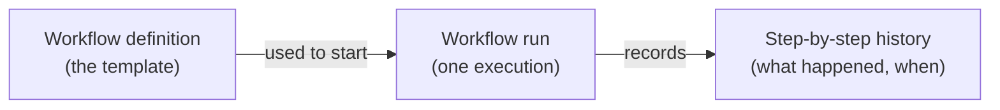
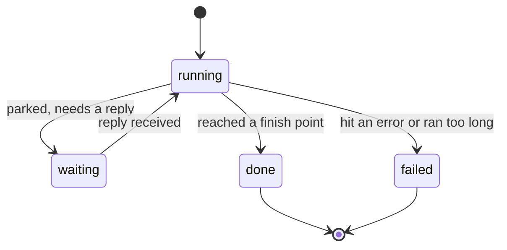
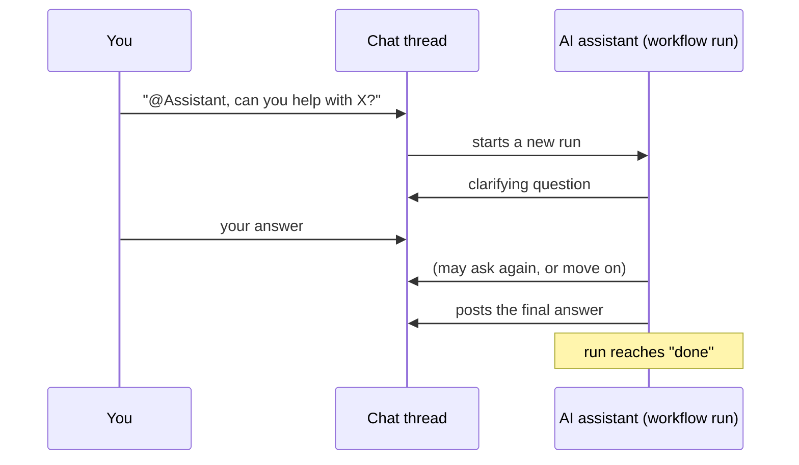
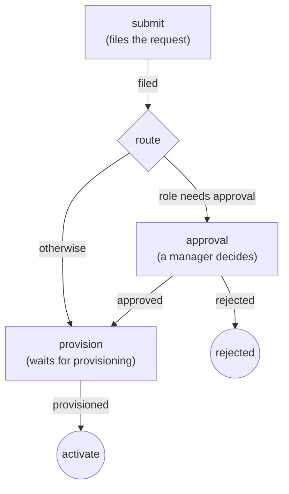
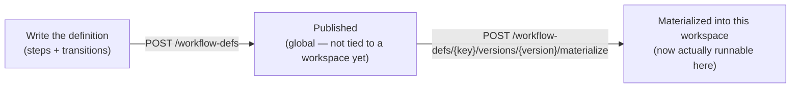
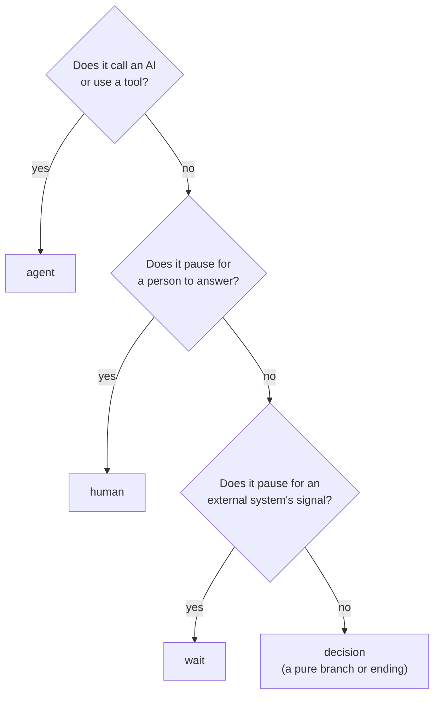

# Workflows in falkor-chat

> **Status:** active · **Owner:** `tico` · **Tracks:** K-022, K-024 (M3)

## Who this is for

Anyone using falkor-chat's web UI who wants an AI assistant to help with a request in a
conversation, or who wants to see what a running assistant conversation or business process is
doing. It also covers the parts that currently only exist as an API surface (no button in the web
UI yet) — useful for an operator or a technical user who needs to drive those directly.

## Overview

A **workflow** is a small flowchart that falkor-chat can run on your behalf: a sequence of steps,
with branches, that gets followed from start to finish. There are two flavors in use today:

- **Conversation workflows** — an AI assistant walks the flowchart *inside a chat thread*. You
  start one by `@mention`-ing the assistant in a message; it asks clarifying questions, looks
  things up, and posts an answer back into the thread — like talking to a very literal-minded
  colleague who follows a checklist.
- **Process workflows** — a business process (e.g., an access request) that pauses at
  human-decision points and waits for someone to respond, instead of an AI driving it. Today these
  are started and driven through the API only — there is no "start a process" button in the web UI
  yet, only a way to inspect one once you know its ID (see the API walkthrough below).

Every workflow is built from a **definition** (the flowchart template — reusable, versioned) and,
each time it's used, a **run** (one execution of that template, with its own history).



A run is always in one of four states:



- **running** — actively being driven right now.
- **waiting** — paused, needs someone (a human, or an external system) to send a reply before it
  continues. This is **not a timer** — nothing in falkor-chat resumes a waiting run just because
  time passed. It only moves when a reply actually arrives.
- **done** — reached a finishing point successfully.
- **failed** — something went wrong (an error, or the run took far more steps than expected —
  a safety limit, not a normal outcome).

## Walkthroughs

### 1. Starting an assistant conversation (chat, web UI)

This is the everyday way most people will use workflows.

1. Open (or start) a thread in the web UI, the way you would for any conversation.
2. Type your message and **`@mention` the assistant by name** — e.g. `@Assistant, can you help me
   figure out our current deploy process?` (the exact name depends on how the workspace was set
   up; ask whoever configured it if `@Assistant` doesn't work).
3. Send the message. The assistant will typically ask a clarifying question first — answer it in
   the thread like a normal chat reply. It keeps asking (one question at a time) until it judges it
   has enough to work with.
4. Once satisfied, it looks up relevant information in the background and then posts an answer
   into the thread.
5. While the conversation is running, a small **run cue** appears at the top of the thread showing
   the definition name and the run's current status (e.g. `triage v1 — running`). Click **View** to
   open the run detail panel.



**A reply in the same thread is enough** — you never need to `@mention` the assistant again once a
conversation has started; your next message is understood as a reply to it, as long as the run is
still `waiting` on that thread.

### 2. Watching a run in progress (the run detail panel)

Click **View** on the run cue (or reopen it later while the run is still going) to see:

- The definition name/version and current status.
- Every step the run has gone through so far, and each one's own status.
- If the run has **failed**, the reason it stopped.
- If the run is a **process workflow** and it's `waiting` on a decision, a small form appears right
  there with whatever question/fields that step is asking for — fill it in and press **Submit** to
  let the run continue (see the walkthrough below for the same mechanism from the API side).
- A **Show trace** toggle, for a detailed technical breakdown of what the assistant did internally
  at each step. It's always there, but it only has anything to show for runs that were started with
  tracing on — most day-to-day runs weren't, so it will just say there's no trace to show.

### 3. Browsing available workflow definitions

Click the **Workflow defs** button (top of the app) to see every published definition in the
workspace, by name and version. Click one to see its full detail: its kind (conversation or
process), and its whole flowchart as a table — every step (with its type, and which one is the
starting step), and every transition between steps (including the condition that decides when it's
taken). This is read-only — a definition is a published template; there's no editing here.

### 4. Driving a process workflow (API — no web UI screen yet)

Process workflows (steps that pause for a human decision, like an access request) are not yet
reachable from the web UI's buttons — starting one and answering its questions today means calling
the API directly. This is the one part of this manual aimed at a more technical user or an
operator, not a typical chat user.

A worked example — requesting access, using the `access-request` process definition that ships as
a demo:



1. **Start the run:**
   ```
   POST /workflow-runs
   { "defKey": "access-request", "version": "v1" }
   ```
   The response includes a `runId` — keep it, there's no run listing page for process runs yet.

2. **Check its status** any time:
   ```
   GET /workflow-runs/{runId}
   GET /workflow-runs/{runId}/step-runs
   ```
   A freshly started run parks immediately at the `submit` step, `status: "waiting"`.

3. **Answer what it's waiting for.** The run tells you (via its current step's `awaiting` info)
   what it needs — e.g. the request details. Send them:
   ```
   POST /workflow-runs/{runId}/input
   { "input": { "request": { "role": "contractor" } } }
   ```
   This both records your answer and lets the run continue on its own until it either finishes or
   parks again at the next decision point (here, a manager's approval, because `"contractor"`
   needs one).

4. **Repeat** step 3 each time the run is `waiting` again — e.g. the manager submits
   `{"decision": "approve"}` at the `approval` step, then whoever runs provisioning submits
   `{"provisioned": true}` at the last step — until the run reaches `done`.

If you submit something the run isn't currently waiting for, or the run isn't parked at all, the
API tells you so rather than silently doing nothing (you'll get a clear error, not a hang).

### 5. Creating and configuring a workflow definition (API — operator/admin)

Publishing a brand-new definition, or a new version of one, is also API-only today — same
audience as the walkthrough above: whoever administers a workspace, not a typical chat user.
It's a two-step process:



1. **Publish** — `POST /workflow-defs` writes the definition once, globally.
2. **Materialize** — `POST /workflow-defs/{key}/versions/{version}/materialize` copies it into
   *this* workspace's own copy, which is what a run actually walks. **A definition that's
   published but not materialized here can't be run in this workspace** — it'll show up in
   `GET /workflow-defs`, but starting a run against it (or `@mention`-ing it, for a conversation
   definition) won't work until this step is done.

> **A conversation definition needs one more thing before `@mention` will start it.** Only one
> conversation definition is "live" for `@mention` at a time, per deployment — which one is set
> by whoever started the server (a server setting, not something this API controls). Publishing
> and materializing a new conversation-kind definition makes it startable directly
> (`POST /workflow-runs`), but it will **not** intercept `@mention`s until whoever runs the
> server points the live setting at it. Ask them if you're not the one running the server.

#### The shape of a definition

```
POST /workflow-defs
{
  "key": "access-request",     // stable id — combined with "version" to address this def
  "version": "v1",             // definitions are versioned; a new version never touches an old one
  "name": "Access request",    // display name (what people see, e.g. in the defs viewer, §3)
  "kind": "process",           // "conversation" (started by @mention) or "process" (API-started)
  "steps": [ ... ],            // at least 1
  "transitions": [ ... ]       // at least 1 — see why below
}
```

> **`config` and `guard` travel as JSON-encoded *strings*, not nested objects.** Every example in
> this section shows the *parsed meaning* of a step's `config` or a transition's `guard` — as a
> plain JSON object, for readability — but on the actual wire each one is a single **string**:
> `"config": "{\"waitsForHuman\":true}"`, not `"config": {"waitsForHuman":true}`. Sending a
> nested object where a string is expected gets a `422` with a cryptic `"Input should be a valid
> string"` — not one of the friendly, named errors below. A fully correct request body, stringified:
> ```json
> { "from": "route", "to": "approval", "on": "needs_approval", "order": 0,
>   "guard": "{\"kind\":\"cmp\",\"path\":\"ctx.request.role\",\"op\":\"in\",\"value\":[\"contractor\",\"exec\"]}" }
> ```

A few rules the server checks **before writing anything** — get one wrong and you get a clear
error back, with nothing half-published:

- Every step needs a unique `key` within the definition.
- **Exactly one** step must be marked `"start": true` — that's where a run begins.
- Every transition's `from`/`to` must name a step that's actually declared.
- The definition needs **at least one transition** — model an ending as a step with no
  *outgoing* transition, not as a definition with zero transitions overall.
- A `human` or `wait` step (below) **must** set `config.waitsForHuman: true`, or it can never
  actually pause — a run that reaches it will eventually be stopped for taking too many steps
  instead.
- If any step's `config.model`, or any `{"kind":"llm"}` guard's `model` (below), names a
  provider or role the server can't resolve, the whole publish is rejected — see `model` under
  the `agent` config, next.

Rough size limits, so you recognize one rather than guessing: up to 200 steps and 500
transitions per definition; each step's `config` and each transition's `guard` is capped at
8000 characters.

#### Choosing a step type



| Type | What it does | Works today? |
|---|---|---|
| `agent` | Runs an AI assistant turn — it reads its instructions, may call the tools you allow, and produces an answer or asks a question. | Yes |
| `human` | Parks the run until a person submits an answer. | Yes |
| `wait` | Parks the run until an external system sends a signal. Mechanically identical to `human` — only the label shown to whoever's watching differs. | Yes |
| `decision` | A pure branch: no action of its own — its outgoing transitions decide where the run goes next. With no outgoing transition, it's an ending. | Yes |
| `prompt`, `tool`, `message` | Reserved for a future release. | **No** — publishing one is accepted, but a run that reaches it fails outright. Don't use these yet. |

What each type's `config` understands (shown **parsed**, as JSON, for readability — stringify it
before sending; see the callout above):

**`agent`**
```json
{
  "systemPrompt": "Plain-language instructions for the assistant at this step.",
  "tools": ["post_message", "graphrag_retrieve"],
  "maxIterations": 4,
  "waitsForHuman": true,
  "model": "reasoning"
}
```
- `systemPrompt` — the instructions this step's turn runs with. Write it like briefing a new,
  very literal-minded colleague — be explicit about what it must do (e.g. "you must call
  `post_message` to speak; text you merely write is never seen by anyone").
- `tools` — which of the built-in tools this step may call. Leaving one out is how you keep a
  step from doing something it shouldn't (an author-set fence, not a permission the model can
  talk its way around). Available today:
  - `post_message` — speak into the thread (ask a question, or deliver an answer).
  - `graphrag_retrieve` — search the workspace for grounding context.
  - `human_handoff` — shipped, but not used by any published definition yet; treat it as
    unproven if you reach for it.
  A name the server doesn't recognize is **not** caught at publish time — it only fails the
  *run*, the first time that step actually tries to call it, so a typo here surfaces much later
  than the other mistakes on this page.
- `maxIterations` — how many back-and-forth turns (model ⇄ tools) this step gets before it's cut
  off and forced to wrap up with whatever it has. Defaults to 4 if omitted.
- `waitsForHuman` — optional here (unlike `human`/`wait`, not mandatory). Set it `true` when this
  step should pause for the person's next chat reply after its turn instead of moving straight
  on — that's how the shipped `triage` flow's first step waits for the user to finish answering
  clarifying questions before research begins.
- `model` — optional; pins this step to a specific `provider/model` (e.g.
  `"lmstudio/qwen/qwen3-4b-2507"`) or a named **role** (e.g. `"reasoning"` above — a stable name
  that can point at a fallback chain of models, defined once and reused across defs) instead of
  the default for this kind of step. Naming a provider/role the server has never heard of is
  rejected **at publish time** (the rule above); naming a real provider but a bad model id on it
  is only caught when the step actually runs. Full picture — how roles/fallback/overrides work,
  and the same `model` key on an `{"kind":"llm"}` guard (next) — is its own manual:
  `docs/manuals/llm-provider-config.md`.

**`human`**
```json
{
  "waitsForHuman": true,
  "prompt": "Approve or reject this access request",
  "fields": ["decision"],
  "expects": {"decision": ["approve", "reject"]},
  "assignee": "manager"
}
```
- `waitsForHuman: true` — **required**.
- `prompt` — shown to whoever needs to answer (surfaced in the run panel's form, §2).
- `fields` — which top-level answer keys this step accepts; anything else submitted is rejected
  — a typo in the field name is a clear error, not a silently ignored answer. Omit it entirely
  to accept anything (not recommended — you lose that safety net).
- `expects` — optionally restricts one of those fields to a fixed set of values (like
  `approve`/`reject` above); anything else is rejected before it's written.
- `assignee` — a label for who this is waiting on (shown in the run panel/API so people know who
  to chase — see the FAQ entry above on a run stuck `waiting`).

**`wait`**
```json
{ "waitsForHuman": true, "signal": "provisioned" }
```
- `waitsForHuman: true` — **required**.
- `signal` — the one key name an external system must submit to release this step (e.g.
  `{"provisioned": true}`). Unlike `human`'s `fields`, this is always exactly one key.
- Still **no timer** — a `wait` step sits parked exactly like a `human` step until that signal
  actually arrives.

⚠️ **`waitsForHuman` doesn't guarantee a pause — a firing transition wins first.** Both `human`
and `wait` share this: if the step's own outgoing transition would fire anyway (most commonly,
an unconditional `""` default guard), the run advances straight past it and never parks, no
matter what `waitsForHuman` says. Give a `human`/`wait` step's outgoing transition a guard that
depends on data it's genuinely waiting for — e.g. `{"kind":"cmp","path":"ctx.decision","op":"exists"}`
— never an unconditional one, or the pause is silently defeated.

**`decision`**
```json
{}
```
No configuration — its behaviour lives entirely in its outgoing transitions (next). ⚠️ If every
outgoing transition is conditional and none of them ever fires, the run just sits there
re-trying the same step until it's stopped for taking too long — give a `decision` step either
an unconditional fallback transition or make sure its conditions are genuinely exhaustive.

#### Writing transitions and guards

A transition connects one step to another and decides *when* it's taken via its `guard` (again
shown **parsed** below — it's a JSON-encoded string on the wire, same as `config`):

```json
{ "from": "route", "to": "approval", "on": "needs_approval", "order": 0,
  "guard": { "kind": "cmp", "path": "ctx.request.role", "op": "in",
             "value": ["contractor", "exec"] } }
```

The same transition, correctly stringified for an actual `POST /workflow-defs` call:

```json
{ "from": "route", "to": "approval", "on": "needs_approval", "order": 0,
  "guard": "{\"kind\":\"cmp\",\"path\":\"ctx.request.role\",\"op\":\"in\",\"value\":[\"contractor\",\"exec\"]}" }
```

- `from` / `to` — the step keys this transition connects.
- `on` — a human-readable label for what this transition means (e.g. `"approved"`) — for people
  reading the definition later; the engine itself doesn't act on it.
- `order` — a tie-breaker, see below.
- `guard` — decides whether this transition fires. Three kinds:

| Guard | Looks like | Fires when |
|---|---|---|
| **Default** | `""` (empty) | Always — use it for an "otherwise, just continue" branch. |
| **AI-judged** | `{"kind": "llm", "text": "the user has provided enough information to research their request"}` | An AI judges, in plain language, whether the condition in `text` currently holds. |
| **Rule-based** | `{"kind": "cmp", "path": "ctx.decision", "op": "eq", "value": "approve"}` | A precise, deterministic check against data the run is carrying — no AI involved. |

An AI-judged guard also accepts an optional `model` key (e.g. `{"kind":"llm","text":"…","model":"reasoning"}`)
— same meaning, same publish-time resolvability check, as the `agent` step's `model` (previous
section).

**Which one to reach for:** a rule-based guard is exact and free — it's what the `access-request`
process definition (§4's worked example) uses throughout, needing no AI at all. An AI-judged
guard is for when the condition is genuinely fuzzy — "has the user given us enough to go on?" —
something no fixed rule could reliably check. **A step's outgoing transitions are tried
conditional-first** (in the `order` you gave them), and the default guard, if there is one, is
only tried last — that's what makes "a specific condition beats the fallback" work without you
having to order things by hand.

Rule-based (`cmp`) guards read one of two places:
- `ctx.<key>` — data the run is carrying: whatever was passed as the run's starting context, plus
  anything submitted while it was parked (§4's `POST /workflow-runs/{runId}/input`) — merged in
  flat, so a submitted `decision` key becomes `ctx.decision`.
- `output` (the current step's raw result) or `output.<key>` (a key inside it, when it's JSON).

compared with one of: `eq`, `ne`, `lt`, `le`, `gt`, `ge`, `in` (the value is in a list at the
path), `contains` (the path holds a list/string containing the value), `exists` (the path has
any value), `truthy`. Combine several with `{"kind": "all", "of": [...]}` /
`{"kind": "any", "of": [...]}`, or negate one with `{"kind": "not", "of": [...]}` (exactly one
child). **A missing value never errors** — a guard whose path isn't there simply evaluates to
"does not fire," so a step with no matching branch just doesn't advance rather than crashing the
run. There are sanity caps to stop a guard from getting out of hand (5 levels of nesting, 32
conditions total, 8 branches per `all`/`any`) — you won't hit them writing an ordinary flow.

See the `access-request` flowchart in §4 for a complete worked example: a `human` step, a pure
`decision` branch with a conditional-plus-default pair of transitions, a second `human` step
with a two-way rule-based branch, and a `wait` step releasing on a signal.

#### Changing a definition later

Once a `(key, version)` has been published, treat it as **frozen — not just structurally, but
entirely**. There are two ways re-publishing the same `key`/`version` can go, and neither one
gets you a live edit:

- **A structural change** — adding or removing a step, rewiring a transition, or changing which
  step is `start` — is **rejected outright**: a clear `409` error, nothing written. This is the
  one re-publish outcome you'll actually notice.
- **A text-only change** — a different `systemPrompt`, a definition's `name`, a guard's wording,
  even just its `model` — is **accepted** (a normal `201`) but **silently has no effect**: the
  version already exists, so the new text is discarded and the old content keeps running. Nothing
  in the response tells you this happened — the only way to know is to read the definition back
  (§3, or `GET /workflow-defs/{key}/versions/{version}`) and see your edit isn't there.

Either way, the fix is the same: **publish a new version** (`v2`, and so on) and materialize
that — the old version keeps running exactly as it did for anyone already partway through it.
There is no in-place edit of an already-published version, for text or for structure.

## FAQ / troubleshooting

**I `@mention`-ed the assistant and nothing happened.**
Check the exact name being used for the assistant in this workspace — it must match precisely. If
it's right and still nothing happens, the workspace may not have a conversation workflow
configured at all; ask whoever set it up.

**The assistant keeps asking me questions and never answers.**
It only moves on once it judges it has enough information — try being more specific in one
message rather than answering minimally across several. If it seems stuck, it may be worth just
restating the whole request in one clear message.

**My run shows `failed` — what do I do?**
Open the run panel — the failure reason is shown there. Two common causes: the run hit its safety
step limit (it took an unusually long path and was stopped as a precaution) or it hit a genuine
error. Either way, the fix is usually to start a fresh run (e.g. `@mention` the assistant again
with a clearer request) rather than trying to resume a failed one — a failed run does not resume.

**A process run has been `waiting` for a long time — will it time out or resume on its own?**
No. Workflows in falkor-chat have no timers — a `waiting` run stays exactly as it is until someone
(or some system) sends the reply it's asking for. If it's been a while, check who the step is
waiting on (its `assignee`, where shown) and follow up with them directly.

**I started a process run through the API — why can't I see it in the web UI?**
That's expected today: the run cue and run panel are wired only to runs that were triggered from a
chat message. A process run started directly via `POST /workflow-runs` has no chat thread
attached, so nothing in the web UI currently surfaces it — use the API endpoints in the walkthrough
above (`GET /workflow-runs/{runId}` and `/step-runs`) to check on it instead.

**Can I edit a workflow definition?**
Not from the web UI — the defs viewer is read-only. Publishing or changing a definition is done
through the API by whoever administers the workspace — see §5 above for the shape of a
definition, what each step type needs, and what "changing" actually means once a version has
been published.

**I published a new definition — why doesn't `GET /workflow-defs` let me run it / why doesn't
`@mention` pick it up?**
Two separate steps are easy to miss. First, publishing only writes it globally — it also needs to
be **materialized** into this workspace (§5) before any run can use it here. Second, for a
*conversation* definition specifically, `@mention` only ever starts **one** definition per
deployment, chosen by a server-level setting — publishing and materializing a new one doesn't
change what `@mention` starts until that setting is repointed at it (§5).

**I re-published a definition with an extra/removed step and got an error.**
That's expected — a version's structure (its steps and how they connect) is locked once
published; changing it on the same `(key, version)` is rejected outright. Publish the changed
shape as a **new version** instead (§5, "Changing a definition later").

**I re-published a definition with just a wording/prompt change, under the same version — no
error, but the change isn't there when I read it back.**
Also expected, and easy to miss precisely because there's no error: only a *structural* change
(adding/removing a step, etc.) is rejected. A text-only change is silently discarded — the
version already exists, so nothing about it actually updates, success response notwithstanding
(§5, "Changing a definition later"). Publish it as a **new version** to make a wording change
take effect.

**What happens if I `@mention` the assistant again while it's already waiting on my reply in that
thread?**
Nothing special — your message is simply treated as the reply the run is waiting for, whether or
not it happens to contain an `@mention`. A thread only ever has the existing waiting run pick up
your next message; mentioning the assistant again does not start a second, separate run alongside
it.
