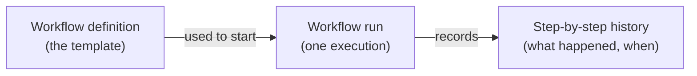
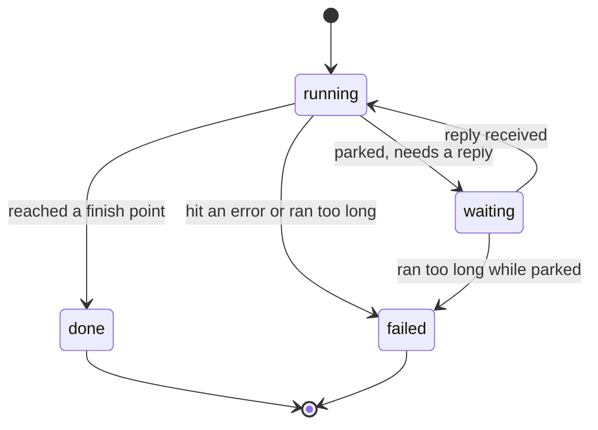
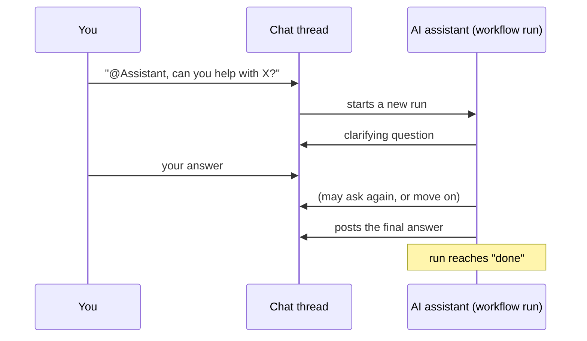
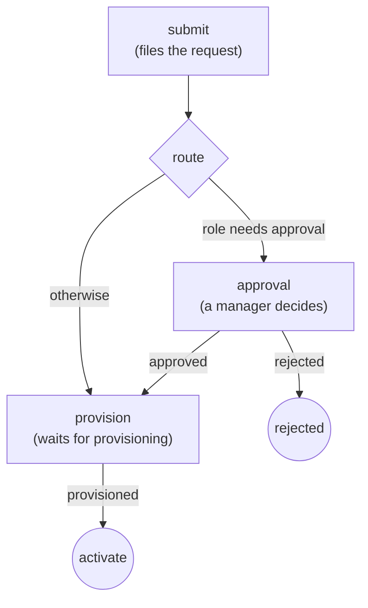

# Workflows in falkor-chat

> **Status:** active · **Owner:** `tico` · **Tracks:** K-022, K-024 (M3)

## Who this is for

Anyone using falkor-chat's web UI who wants an AI assistant to help with a request in a
conversation, or who wants to see what a running assistant conversation or business process is
doing. It also covers the parts that currently only exist as an API surface (no button in the web
UI yet) — useful for an operator or a technical user who needs to drive those directly.

## Overview

A **workflow** is a small flowchart that falkor-chat can run on your behalf: a sequence of steps,
with branches, that gets followed from start to finish. There are two flavors in use today:

- **Conversation workflows** — an AI assistant walks the flowchart *inside a chat thread*. You
  start one by `@mention`-ing the assistant in a message; it asks clarifying questions, looks
  things up, and posts an answer back into the thread — like talking to a very literal-minded
  colleague who follows a checklist.
- **Process workflows** — a business process (e.g., an access request) that pauses at
  human-decision points and waits for someone to respond, instead of an AI driving it. Today these
  are started and driven through the API only — there is no "start a process" button in the web UI
  yet, only a way to inspect one once you know its ID (see the API walkthrough below).

Every workflow is built from a **definition** (the flowchart template — reusable, versioned) and,
each time it's used, a **run** (one execution of that template, with its own history).



A run is always in one of four states:



- **running** — actively being driven right now.
- **waiting** — paused, needs someone (a human, or an external system) to send a reply before it
  continues. This is **not a timer** — nothing in falkor-chat resumes a waiting run just because
  time passed. It only moves when a reply actually arrives.
- **done** — reached a finishing point successfully.
- **failed** — something went wrong (an error, or the run took far more steps than expected —
  a safety limit, not a normal outcome).

## Walkthroughs

### 1. Starting an assistant conversation (chat, web UI)

This is the everyday way most people will use workflows.

1. Open (or start) a thread in the web UI, the way you would for any conversation.
2. Type your message and **`@mention` the assistant by name** — e.g. `@Assistant, can you help me
   figure out our current deploy process?` (the exact name depends on how the workspace was set
   up; ask whoever configured it if `@Assistant` doesn't work).
3. Send the message. The assistant will typically ask a clarifying question first — answer it in
   the thread like a normal chat reply. It keeps asking (one question at a time) until it judges it
   has enough to work with.
4. Once satisfied, it looks up relevant information in the background and then posts an answer
   into the thread.
5. While the conversation is running, a small **run cue** appears at the top of the thread showing
   the definition name and the run's current status (e.g. `triage v1 — running`). Click **View** to
   open the run detail panel.



**A reply in the same thread is enough** — you never need to `@mention` the assistant again once a
conversation has started; your next message is understood as a reply to it, as long as the run is
still `waiting` on that thread.

### 2. Watching a run in progress (the run detail panel)

Click **View** on the run cue (or reopen it later while the run is still going) to see:

- The definition name/version and current status.
- Every step the run has gone through so far, and each one's own status.
- If the run has **failed**, the reason it stopped.
- If the run is a **process workflow** and it's `waiting` on a decision, a small form appears right
  there with whatever question/fields that step is asking for — fill it in and press **Submit** to
  let the run continue (see the walkthrough below for the same mechanism from the API side).
- An optional **Show trace** toggle, for a detailed technical breakdown of what the assistant did
  internally at each step (only present for runs started with tracing on — most day-to-day runs
  won't have one).

### 3. Browsing available workflow definitions

Click the **Workflow defs** button (top of the app) to see every published definition in the
workspace — its name, version, and kind. Click one to see its full flowchart as a table: every
step (with its type, and which one is the starting step), and every transition between steps
(including the condition that decides when it's taken). This is read-only — a definition is a
published template; there's no editing here.

### 4. Driving a process workflow (API — no web UI screen yet)

Process workflows (steps that pause for a human decision, like an access request) are not yet
reachable from the web UI's buttons — starting one and answering its questions today means calling
the API directly. This is the one part of this manual aimed at a more technical user or an
operator, not a typical chat user.

A worked example — requesting access, using the `access-request` process definition that ships as
a demo:



1. **Start the run:**
   ```
   POST /workflow-runs
   { "defKey": "access-request", "defVersion": "v1" }
   ```
   The response includes a `runId` — keep it, there's no run listing page for process runs yet.

2. **Check its status** any time:
   ```
   GET /workflow-runs/{runId}
   GET /workflow-runs/{runId}/step-runs
   ```
   A freshly started run parks immediately at the `submit` step, `status: "waiting"`.

3. **Answer what it's waiting for.** The run tells you (via its current step's `awaiting` info)
   what it needs — e.g. the request details. Send them:
   ```
   POST /workflow-runs/{runId}/input
   { "input": { "request": { "role": "contractor" } } }
   ```
   This both records your answer and lets the run continue on its own until it either finishes or
   parks again at the next decision point (here, a manager's approval, because `"contractor"`
   needs one).

4. **Repeat** step 3 each time the run is `waiting` again — e.g. the manager submits
   `{"decision": "approve"}` at the `approval` step, then whoever runs provisioning submits
   `{"provisioned": true}` at the last step — until the run reaches `done`.

If you submit something the run isn't currently waiting for, or the run isn't parked at all, the
API tells you so rather than silently doing nothing (you'll get a clear error, not a hang).

## FAQ / troubleshooting

**I `@mention`-ed the assistant and nothing happened.**
Check the exact name being used for the assistant in this workspace — it must match precisely. If
it's right and still nothing happens, the workspace may not have a conversation workflow
configured at all; ask whoever set it up.

**The assistant keeps asking me questions and never answers.**
It only moves on once it judges it has enough information — try being more specific in one
message rather than answering minimally across several. If it seems stuck, it may be worth just
restating the whole request in one clear message.

**My run shows `failed` — what do I do?**
Open the run panel — the failure reason is shown there. Two common causes: the run hit its safety
step limit (it took an unusually long path and was stopped as a precaution) or it hit a genuine
error. Either way, the fix is usually to start a fresh run (e.g. `@mention` the assistant again
with a clearer request) rather than trying to resume a failed one — a failed run does not resume.

**A process run has been `waiting` for a long time — will it time out or resume on its own?**
No. Workflows in falkor-chat have no timers — a `waiting` run stays exactly as it is until someone
(or some system) sends the reply it's asking for. If it's been a while, check who the step is
waiting on (its `assignee`, where shown) and follow up with them directly.

**I started a process run through the API — why can't I see it in the web UI?**
That's expected today: the run cue and run panel are wired only to runs that were triggered from a
chat message. A process run started directly via `POST /workflow-runs` has no chat thread
attached, so nothing in the web UI currently surfaces it — use the API endpoints in the walkthrough
above (`GET /workflow-runs/{runId}` and `/step-runs`) to check on it instead.

**Can I edit a workflow definition?**
Not from the web UI — the defs viewer is read-only. Publishing or changing a definition is done
through the API by whoever administers the workspace.
