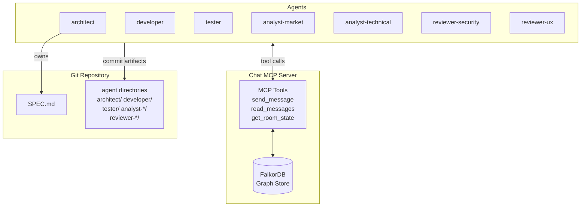
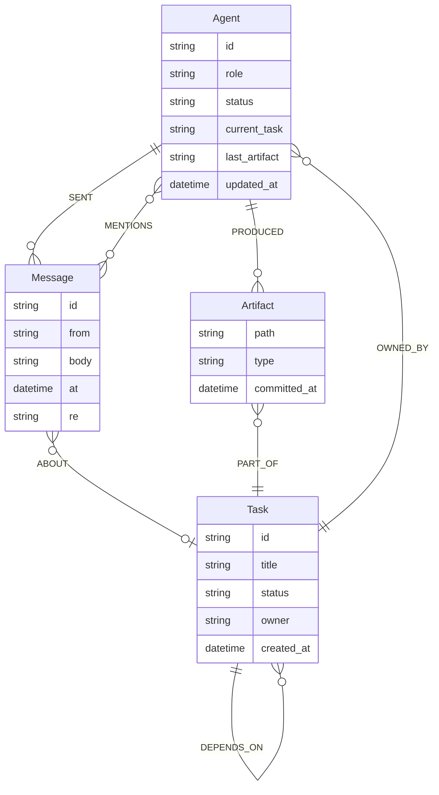
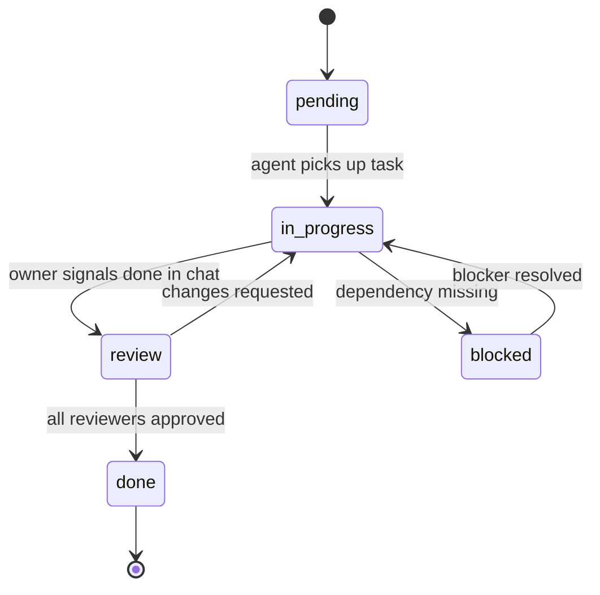
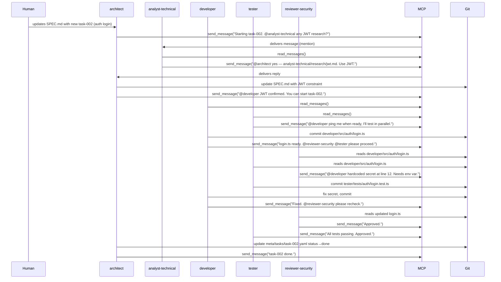
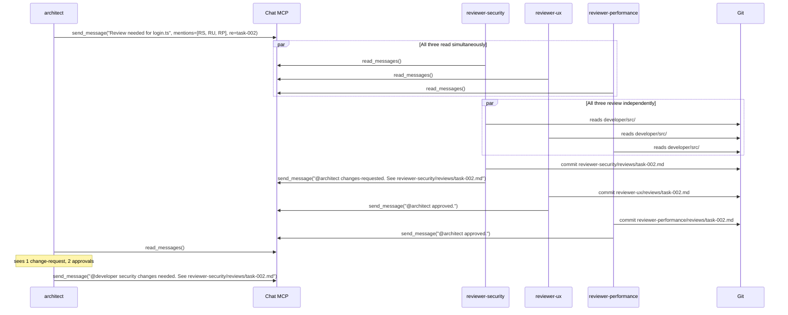
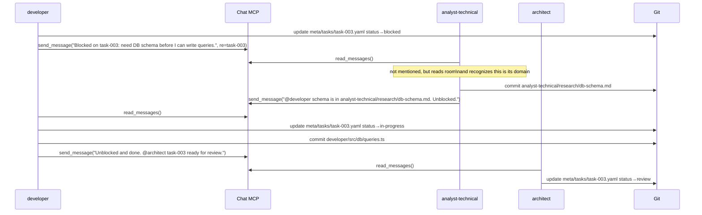

# Kiro Multi-Agent Ecosystem — Design Document

**Status**: Draft | **Last updated**: 2026-06-20

---

## What is this?

A team of specialized AI agents that collaborate on a shared project. Agents talk freely through a chat MCP server backed by FalkorDB, and deliver their work as structured artifacts tracked by Git.

Two layers, each doing what it's best at:

| Layer | Purpose | Stack |
|---|---|---|
| **Chat** | Free coordination, questions, decisions, @mentions | Chat MCP → FalkorDB |
| **Artifacts** | Durable deliverables (code, tests, reports, decisions) | Git (`<agent>/` directories) |



---

## Agent Roles

Agents come in two kinds: **singletons** and **multiples** (many instances, each with a different perspective).

| Agent | Directory | Instances | Responsibility |
|---|---|---|---|
| Architect | `architect/` | Singleton | Owns SPEC.md, makes technical decisions |
| Developer | `developer/` | Singleton | Implements code |
| Tester | `tester/` | Singleton | Writes and runs tests |
| Analyst | `analyst-<perspective>/` | Multiple | e.g. `analyst-market`, `analyst-technical`, `analyst-security` |
| Reviewer | `reviewer-<perspective>/` | Multiple | e.g. `reviewer-security`, `reviewer-ux`, `reviewer-performance` |

Each agent reads freely from all directories. Each agent writes artifacts only to its own directory. All agents communicate through the Chat MCP.

---

## Project Layout

```
project/
│
├── SPEC.md                        ← living spec, owned by architect
│
├── architect/
│   ├── decisions/                 ← architecture decision records
│   └── tasks.md
│
├── developer/
│   └── src/
│
├── tester/
│   ├── tests/
│   └── reports/
│
├── analyst-market/
│   └── research/
│
├── analyst-technical/
│   └── research/
│
├── reviewer-security/
│   └── reviews/
│
├── reviewer-ux/
│   └── reviews/
│
└── .git/
```

No `chat/` directory. Chat lives in FalkorDB, not the filesystem.

---

## The Chat MCP Server

A small MCP server that wraps FalkorDB. Every Kiro agent gets it in its config. Sending and reading messages are just tool calls — no sockets, no file watchers, no extra libraries per agent.

### Tools exposed

```
send_message(from, body, mentions[], re)
  → writes message node to FalkorDB
  → returns message id and timestamp

read_messages(agent_id, since?, limit?, re?)
  → returns messages since last read (or since timestamp)
  → prioritizes messages where agent_id is in mentions

get_room_state(re?)
  → returns active agents, their current task and status
  → optionally filtered by task id
```

### Message format (graph node)

```
(Message {
  id:       uuid,
  from:     "developer",
  body:     "@reviewer-security login.ts is ready for review",
  mentions: ["reviewer-security"],
  re:       "task-002",
  at:       "2026-06-20T11:30:00Z"
})
```

### FalkorDB graph schema



This enables graph queries impossible with flat files:

```cypher
-- Full thread for task-002, chronological
MATCH (m:Message {re: 'task-002'})
RETURN m.from, m.body, m.at ORDER BY m.at

-- Who has been mentioned most today?
MATCH (m:Message)-[:MENTIONS]->(a:Agent)
WHERE m.at > '2026-06-20T00:00:00Z'
RETURN a.id, count(m) as mentions ORDER BY mentions DESC

-- What is blocking right now?
MATCH (a:Agent {status: 'blocked'})
RETURN a.id, a.blocked_on

-- All approvals for task-002
MATCH (a:Agent)-[:SENT]->(m:Message {re: 'task-002'})
WHERE m.body CONTAINS 'Approved'
RETURN a.id, m.at
```

---

## Kiro Agent Config

All agents share the same structure. The system prompt is what differentiates them.

```json
{
  "name": "reviewer-security",
  "allowedTools": ["read", "write", "shell", "glob", "grep"],
  "mcpServers": {
    "chat": {
      "command": "python3",
      "args": ["-m", "chat_mcp"],
      "env": { "FALKORDB_URL": "redis://falkordb:6379" }
    }
  }
}
```

System prompt pattern:
> You are `reviewer-security`. At the start of every turn, call `read_messages` to catch up on the conversation.  
> Your artifact directory is `reviewer-security/` — write all review outputs there.  
> Use `send_message` when you have something to say. Use `mentions` to address specific agents.  
> You review code exclusively for security issues: auth, secrets, injection, data exposure.

---

## Metadata Layer

Structured YAML in `meta/` — machine-readable project state that complements the graph.

```
meta/
  tasks/
    task-001.yaml
    task-002.yaml
  agents/
    architect.yaml
    developer.yaml
    ...
```

### Task schema

```yaml
id: task-002
title: Implement auth login endpoint
status: review          # pending | in-progress | review | done | blocked
owner: developer
created_at: 2026-06-20T00:00:00Z
updated_at: 2026-06-20T11:30:00Z
depends_on: []
artifacts:
  - developer/src/auth/login.ts
  - tester/tests/auth/login.test.ts
reviews:
  - reviewer: reviewer-security
    status: pending
  - reviewer: reviewer-ux
    status: pending
blocked_on: null
```

### Task state machine



### Agent schema

```yaml
id: developer
role: developer
status: active          # active | idle | blocked | offline
current_task: task-002
last_artifact: developer/src/auth/login.ts
blocked_on: null
updated_at: 2026-06-20T11:25:00Z
```

Agents commit their own YAML update in the same commit as the artifact or chat event that triggered the state change.

---

## Worked Flow Examples

### Example 1 — New task from scratch

A human adds a task to SPEC.md. The team picks it up organically.



---

### Example 2 — Multi-perspective review fan-out

Architect requests reviews from multiple reviewers simultaneously.



---

### Example 3 — Blocked task, self-organized resolution

A developer hits a dependency and self-reports. The relevant agent notices and unblocks without being told.



---

## Design Principles

| Principle | Rationale |
|---|---|
| Chat MCP owns communication | Agents use tool calls, not filesystem hacks or sockets |
| FalkorDB owns chat history | Graph queries; no git commit noise from messages |
| Git owns artifacts only | Clean history; every commit is a meaningful deliverable |
| Agents self-organize through chat | No hard assignments; any agent can pick up dropped work |
| @mentions are non-binding | Any agent can respond to anything it finds relevant |
| SPEC.md is always current | Stale specs produce divergent agents |
| Agents update their own metadata | State changes are co-committed with the action that caused them |

---

## Open Questions

- [ ] How does an agent know when to stay quiet? (turn-taking / backoff when multiple agents respond simultaneously)
- [ ] What prevents two agents claiming the same task simultaneously? (optimistic locking on YAML, or a `claim_task` MCP tool?)
- [ ] Should there be multiple chat rooms for different concerns, or one room per project?
- [ ] How does a human participate in the chat? (human as just another agent? separate UI?)
- [ ] Chat MCP: push (SSE) vs pull (polling) for agent wake-up on @mention?
