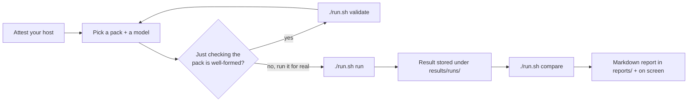
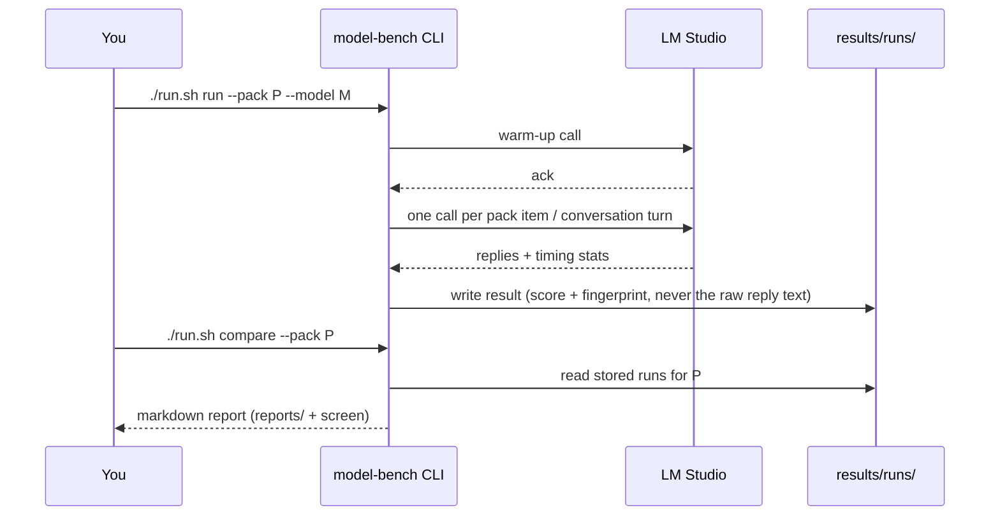

# Small-Model Benchmarking — User Manual

> **Status:** active · **Owner:** `tico` · **Tracks:** — · **Last updated:** 2026-09-18

## Who this is for

Anyone who wants to know, on their own machine, whether one local model does a job better than
another — "does this new model answer support questions more accurately than the one we're using
now?", "which of these embedding models retrieves better for our data?" — and wants that answer
tied to real evidence instead of a published leaderboard number. You need LM Studio running
locally with at least one model downloaded; no cloud account, no CI, nothing else running.

## Overview

`model-bench` measures **one local model** against **one versioned task pack** (a fixed set of
test items for one job — e.g. "call the right tool in a shop-assistant conversation," or "embed
these documents so the right one comes back first"). Every result is stored together with a
fingerprint of the exact environment it ran under, so a result from today can be honestly compared
against a result from three months ago on the same hardware — never against a different pack, a
different role, or a different machine's numbers.

Three things it deliberately does **not** do, because it's easy to expect them from a "benchmark"
tool: it never runs on its own (no CI hook, no scheduler — only a person typing a command starts
it); it never declares a model "passing" or "failing" (no threshold, no gate); and it never adds
scores across different jobs into one leaderboard number (a `tool-caller` score and an `embedder`
score aren't the same kind of thing, so nothing adds them together).



## Walkthroughs

### 1. One-time setup

```bash
cd model-bench
./setup.sh                        # creates .venv, installs the tool
./run.sh --help                   # confirms it's working
```

### 2. Attest your host (once per machine, redo if hardware/LM Studio changes)

A few facts about your setup — LM Studio's own app version, its KV-cache setting, how much RAM
your machine has, what else is running alongside it — can't be read from LM Studio automatically,
so you tell the tool once and it remembers:

```bash
./run.sh attest
```

This writes `host.json` (not checked into git — it's specific to your machine) and prompts you for
anything it can't fill in on its own. If you already know the values you want to set, pass them
directly: `./run.sh attest --set hostRamGb=16`. Every later run copies these facts into its own
result record, so a result stays self-contained even if you attest again later. If `host.json` is
missing or stale (LM Studio itself changed since you last attested), `run` refuses rather than
silently recording something that's no longer true.

### 3. Pick a pack and a model

A **pack** is one job to test. Right now there are five:

| Pack id | Tests the job of… | Needs a model that can… |
|---|---|---|
| `embedder-graphrag-retrieval` | embedding text for retrieval | produce embeddings |
| `guard-judge-understanding` | judging/classifying content | chat |
| `nlq-structured-query` | turning a question into a structured query | chat |
| `tool-caller-shop-assistant` | holding a conversation and calling tools correctly | chat — a model that explicitly advertises no tool-calling capability is refused; most models don't declare either way, and for those the pack also recognizes tool calls written out in prose |
| `chat-responder-grounded-answers` | answering questions grounded in given context | chat |

Ask Tico ("list all available models for the bench mark") at any time for the live list of what
LM Studio currently has on hand, since that list is whatever's loaded in LM Studio on your machine
right now — model-bench doesn't keep its own copy of it. Match the model's type to the pack: the
embedder pack needs one of LM Studio's `embeddings`-type models, everything else needs a chat
(`llm`/`vlm`-type) model.

### 4. (Optional) Validate a pack before spending a live run on it

No LM Studio connection needed — just checks the pack's own files are well-formed:

```bash
./run.sh validate --pack packs/tool-caller-shop-assistant
```

Useful mainly if you're building a new pack; skip it for an existing shipped pack, it's already
valid.

### 5. Run one model against one pack

```bash
./run.sh run --pack tool-caller-shop-assistant --model qwen/qwen3-4b-2507
```

This drives that model through every item (or, for `tool-caller`, every scripted conversation) in
the pack, talking to your live LM Studio, and — if it succeeds — stores the result under
`results/runs/`. A few optional flags:

- `--session <id>` — tag this run so you can pull it back out later with `--session` on `compare`.
- `--reference <key>` — mark a second model as the thing you're comparing *against*, if you already
  know which pair you want to compare.
- `--warmup <n>` — extra throwaway calls before the timed ones, if you want the model "warmed up"
  first.
- `--first-call-timeout <s>` / `--request-timeout <s>` — how long to wait for the first (warm-up)
  call and for each scored call, if the defaults are too tight for your hardware.

Nothing about the score decides whether this command "succeeds" — a run only fails for operational
reasons (see Troubleshooting below), never because a model scored badly.

### 5a. Testing several models in one sweep

There's no built-in "run N models" command — `run` is deliberately one model per invocation (see
Overview: no scheduler, no batch mode). The easiest way to sweep a subset is a plain shell loop,
tagging every run with the same `--session` so you can pull the whole batch back out together
afterward:

```bash
MODELS=("qwen/qwen3-4b-2507" "mistralai/ministral-3-3b" "qwen2.5-3b-instruct")
for m in "${MODELS[@]}"; do
  ./run.sh run --pack tool-caller-shop-assistant --model "$m" --session batch-20260918 || \
    echo "!! $m failed operationally, continuing"
done
./run.sh compare --pack tool-caller-shop-assistant --session batch-20260918
```

The `|| echo ...` matters: a `run` only exits non-zero for an operational reason (see
Troubleshooting), never a bad score, but that's still enough to stop a loop that isn't guarded
against it. Every model in the loop needs to be the right type for the pack (see the table in step
3), and each run is a full live pass through the pack, so N models costs roughly N× one pack's
runtime.

### 6. See what's already been tested

Before running a model again, check whether it already has a stored result:

```bash
./run.sh models --tested --pack tool-caller-shop-assistant
```

### 7. Compare two runs

```bash
./run.sh compare --pack tool-caller-shop-assistant --models qwen/qwen3-4b-2507,mistralai/ministral-3-3b
```

This reads the stored runs for that pack, renders a markdown report to both `reports/` and your
screen, and never overwrites an earlier same-day report for the same pack (it appends a sequence
number instead). Leave off `--models` and it picks from whatever's stored for that pack; use
`--session <id>` to compare only runs you tagged together in step 5.



## FAQ / troubleshooting

**How do I view a report after it's written?** You don't need to hunt for it — `compare` prints
the same markdown to your screen as it runs. The saved copy is plain text at
`reports/<pack-id>-<date>-<NN>.md` (the two-digit suffix is a same-day sequence number, so a
re-run never overwrites an earlier report); open it in any markdown viewer or editor, or `cat` it.
Pass `--out <path>` on `compare` if you'd rather it land somewhere else entirely.

**"LM Studio unreachable" / exit code 3.** LM Studio isn't running, isn't answering its
`/api/v0/models` catalog endpoint, or didn't respond to the warm-up call in time. Start LM Studio
(or load the model) and try again; if it's slow to warm up, raise `--first-call-timeout`.

**"Invalid pack" / exit code 4.** Usually means the model you picked doesn't match what the pack
needs (e.g. you pointed the embedder pack at a chat model), or — for `tool-caller` specifically —
a conversation had to be cut short because a tool call couldn't be dispatched. In that last case
the partial result is still written to `results/runs/` before the tool reports the failure, so
nothing is silently lost.

**"Fingerprint incomplete" / exit code 5.** Run `./run.sh attest` again — either you haven't
attested this host yet, or something about your LM Studio setup changed since you last did.

**Why doesn't a bad score make the command fail?** By design. There's no "passing" score in this
tool — see Overview. A non-zero exit always means something operational went wrong, never that a
model did poorly.

**What does `--negative-control` on `compare` actually prove?** It compares one stored run against
a copy of *itself*, so the two "arms" are guaranteed identical — it's a smoke check that the
comparison machinery is wired correctly, not a real result. Two genuinely independent runs of the
same model is the real version of that check.

**Can I see the model's actual replies afterward?** No — a stored result never keeps the raw reply
text, only the score and a small scoring detail block. To see what a model actually said for a
particular item, you'd need to run it again live.

**Where do the numbers in a report come from — is a small difference between two models
meaningful?** The report accounts for run-to-run noise with confidence intervals and flags when a
difference isn't large enough to be sure of; if you want the statistical reasoning behind that,
ask Tico or see `docs/plans/small-model-benchmarking-ml.md` at the repo root.
